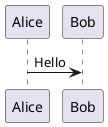

# PlantUML 환경 설치 및 설정 (Windows)

이 문서는 Windows 환경에서 PlantUML을 로컬로 렌더링하기 위한 Java 및 Graphviz 설치와 VS Code 설정을 안내합니다.

## 1. 개요
- 필요한 요소: Java (OpenJDK), Graphviz (dot 렌더러), VS Code + PlantUML 확장
- 목적: `.puml/.plantuml` 파일을 VS Code에서 로컬로 미리보기하고 PNG/SVG로 내보내기

## 2. Java 설치 (OpenJDK)
1. AdoptOpenJDK 또는 OpenJDK 배포판을 설치합니다 (예: Azul Zulu, Amazon Corretto 등).
2. Windows 설치(예: Amazon Corretto) 예시: (관리자 권한)
```powershell
# 1. 관리자 권한 체크
if (!([Security.Principal.WindowsPrincipal][Security.Principal.WindowsIdentity]::GetCurrent()).IsInRole([Security.Principal.WindowsBuiltInRole] "Administrator")) {
    Write-Error "이 스크립트는 관리자 권한으로 실행되어야 합니다."
    exit
}

Write-Host "--- Amazon Corretto 21(17) 설치를 시작합니다 ---" -ForegroundColor Cyan

# 2. Chocolatey를 이용한 Corretto 설치
# --yes: 모든 프롬프트에 자동 동의
# --no-progress: 콘솔 로그 단순화 (선택 사항)
choco install amazoncorretto21 --yes
# choco install amazoncorretto17 --yes

# 3. 설치 후 환경 변수 갱신 (현재 세션에 즉시 반영)
$env:Path = [System.Environment]::GetEnvironmentVariable("Path","Machine") + ";" + [System.Environment]::GetEnvironmentVariable("Path","User")

# 4. 설치 결과 확인
if (Get-Command java -ErrorAction SilentlyContinue) {
    $javaVersion = java -version 2>&1
    Write-Host "`n[성공] Amazon Corretto가 설치되었습니다." -ForegroundColor Green
    Write-Host $javaVersion
} else {
    Write-Host "`n[실패] 설치 중 오류가 발생했거나 경로가 인식되지 않습니다." -ForegroundColor Red
}

Write-Host "`n--- 스크립트 종료 ---" -ForegroundColor Cyan
```
- 수동 설치 시: https://aws.amazon.com/ko/corretto/ 에서 설치 후 `JAVA_HOME`을 설정합니다.

3. 설치 확인:
```powershell
java -version
```

## 3. Graphviz 설치
1. Chocolatey로 설치(권장):
```powershell
choco install graphviz -y
```
2. 직접 설치: https://graphviz.org/download/ 에서 Windows MSI 다운로드 후 설치
3. 설치 후 `dot` 실행 가능한지 확인:
```powershell
dot -V
```
- 필요 시 Graphviz 설치 폴더(예: `C:\Program Files\Graphviz\bin`)를 `PATH`에 추가하세요.

## 4. VS Code 확장 설치
- 추천 확장: `PlantUML (by jebbs)`
```powershell
code --install-extension jebbs.plantuml
```

## 5. PlantUML 설정 (VS Code)
- 기본적으로 `jebbs.plantuml`은 로컬 Java + Graphviz를 사용합니다.
- 필요 시 `plantuml.server` 설정으로 원격 서버 렌더링을 사용할 수 있습니다.

VS Code 사용자 설정 예제 (`settings.json`):
```json
{
  "plantuml.exportFormat": "png",
  "plantuml.render": "PlantUMLServer", // 또는 "Local" 로컬 렌더링
  "plantuml.server": "https://www.plantuml.com/plantuml" // 원격 사용 시
}
```
- 로컬 렌더링을 쓰려면 `plantuml.render`를 `Local`로 설정하세요.

## 6. C4-PlantUML 사용
- 원격 포함 예시:
```puml
@startuml
!includeurl https://raw.githubusercontent.com/plantuml-stdlib/C4-PlantUML/master/C4_Context.puml

Person(user, "User")
System(app, "My Application")
Rel(user, app, "Uses")
@enduml
```
- 오프라인 사용 시 C4-PlantUML 소스 파일들을 프로젝트에 복사하고 `!include`로 참조하세요.

## 7. 예시 파일 작성 및 미리보기
1. `diagram.puml` 파일 생성:

2. VS Code에서 파일 열기 → 우클릭 → `Preview Current Diagram` 또는 커맨드 팔레트에서 `PlantUML: Preview Current Diagram` 실행
3. 미리보기의 내보내기 버튼으로 PNG/SVG 저장

## 8. 문제해결 팁
- `Preview`가 흰화면이면 Java/Graphviz 설치 및 `PATH` 확인
- 원격 서버로 렌더링 시 회사 방화벽/프록시 확인

---
작성자: 자동 생성 가이드

## 관리자용 설치 스크립트 (권장)

관리자 권한 PowerShell에서 자동으로 Java(OpenJDK)와 Graphviz를 설치하려면 아래 제공된 스크립트를 사용하세요. 이 스크립트는 Chocolatey가 있으면 choco로 시도하고, 실패하면 `winget` 대체를 시도합니다. 설치 로그는 스크립트와 동일 폴더에 `install_plantuml_admin.log`로 저장됩니다.

**파일**: `tools/install_plantuml_admin.ps1`

관리자 PowerShell에서 실행 예:

```powershell
# 관리자 권한으로 PowerShell 열기
powershell -ExecutionPolicy Bypass -File .\tools\install_plantuml_admin.ps1
```

성공/실패 확인 방법:

```powershell
# Java 확인
java -version

# Graphviz 확인
dot -V

# 로그 파일 보기
Get-Content .\tools\install_plantuml_admin.log -Tail 200
```

만약 설치 중 권한 문제 또는 패키지 없음 오류가 발생하면, 로그 파일(`install_plantuml_admin.log`)의 마지막 부분을 확인하시고 안내에 따라 수동으로 다음 사이트에서 설치하세요:

- Amazon Corretto / OpenJDK: https://aws.amazon.com/corretto/ 또는 https://adoptium.net/
- Graphviz: https://graphviz.org/download/

스크립트가 관리자 권한으로 재실행을 시도하지만, 자동 권한 상승이 실패하면 수동으로 "관리자 권한으로 PowerShell 실행" 후 다시 실행해 주세요.

