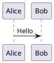

# PlantUML 환경 설치 및 설정 (Windows)

이 문서는 Windows 환경에서 PlantUML을 로컬로 렌더링하기 위한 Java 및 Graphviz 설치와 VS Code 설정을 안내합니다.

## 1. 개요
- 필요한 요소: Java (OpenJDK), Graphviz (dot 렌더러), VS Code + PlantUML 확장
- 목적: `.puml/.plantuml` 파일을 VS Code에서 로컬로 미리보기하고 PNG/SVG로 내보내기

## 2. Java 설치 (OpenJDK)
1. AdoptOpenJDK 또는 OpenJDK 배포판을 설치합니다 (예: Azul Zulu, Amazon Corretto 등).
2. Windows 설치(예: Azul Zulu) 예시:
```powershell
choco install zulu11 -y
```
- 수동 설치 시: https://adoptium.net/ 에서 설치 후 `JAVA_HOME`을 설정합니다.

3. 설치 확인:
```powershell
java -version
```

## 3. Graphviz 설치
1. Chocolatey로 설치(권장):
```powershell
choco install graphviz -y
```
2. 직접 설치: https://graphviz.org/download/ 에서 Windows MSI 다운로드 후 설치
3. 설치 후 `dot` 실행 가능한지 확인:
```powershell
dot -V
```
- 필요 시 Graphviz 설치 폴더(예: `C:\Program Files\Graphviz\bin`)를 `PATH`에 추가하세요.

## 4. VS Code 확장 설치
- 추천 확장: `PlantUML (by jebbs)`
```powershell
code --install-extension jebbs.plantuml
```

## 5. PlantUML 설정 (VS Code)
- 기본적으로 `jebbs.plantuml`은 로컬 Java + Graphviz를 사용합니다.
- 필요 시 `plantuml.server` 설정으로 원격 서버 렌더링을 사용할 수 있습니다.

VS Code 사용자 설정 예제 (`settings.json`):
```json
{
  "plantuml.exportFormat": "png",
  "plantuml.render": "PlantUMLServer", // 또는 "Local" 로컬 렌더링
  "plantuml.server": "https://www.plantuml.com/plantuml" // 원격 사용 시
}
```
- 로컬 렌더링을 쓰려면 `plantuml.render`를 `Local`로 설정하세요.

## 6. C4-PlantUML 사용
- 원격 포함 예시:
```puml
@startuml
!includeurl https://raw.githubusercontent.com/plantuml-stdlib/C4-PlantUML/master/C4_Context.puml

Person(user, "User")
System(app, "My Application")
Rel(user, app, "Uses")
@enduml
```
- 오프라인 사용 시 C4-PlantUML 소스 파일들을 프로젝트에 복사하고 `!include`로 참조하세요.

## 7. 예시 파일 작성 및 미리보기
1. `diagram.puml` 파일 생성:

2. VS Code에서 파일 열기 → 우클릭 → `Preview Current Diagram` 또는 커맨드 팔레트에서 `PlantUML: Preview Current Diagram` 실행
3. 미리보기의 내보내기 버튼으로 PNG/SVG 저장

## 8. 문제해결 팁
- `Preview`가 흰화면이면 Java/Graphviz 설치 및 `PATH` 확인
- 원격 서버로 렌더링 시 회사 방화벽/프록시 확인

---
작성자: 자동 생성 가이드
