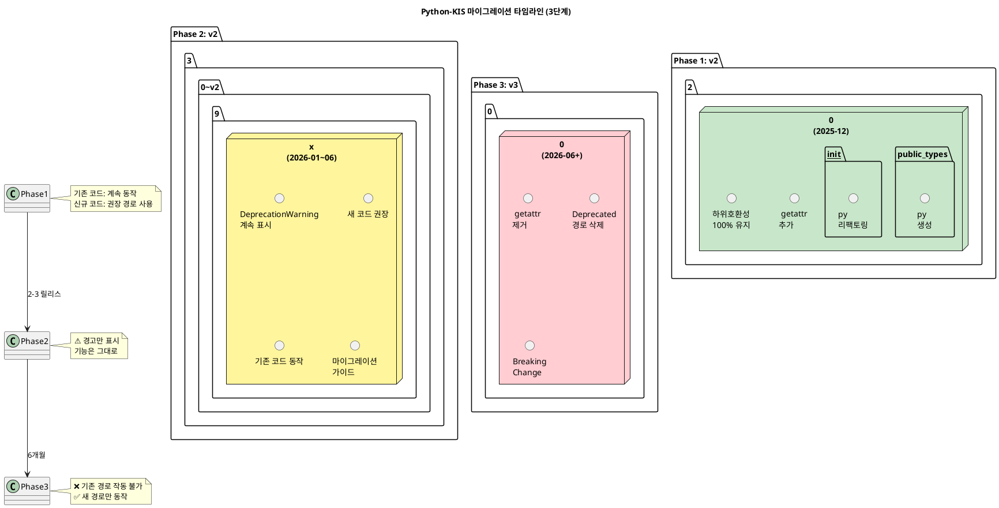
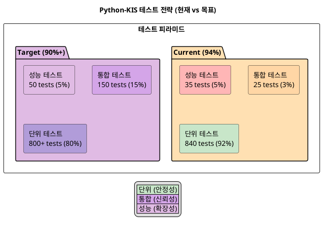

# Python-KIS 아키텍처 개선 보고서 v3 (통합본)

**작성일**: 2025년 12월 18일
**이전 버전**: v1 (2025-12-10), v2 (2025-12-17)
**대상**: 사용자 및 소프트웨어 엔지니어
**목적**: 최신 프로젝트 현황을 반영한 아키텍처 개선 전략 및 실행 계획 제시

---

## 문서 개요

이 보고서는 Python-KIS 프로젝트의 **v2 종합 분석(2025-12-17, 단위 테스트 커버리지 94%)**을 기반으로 하며, v1의 상세한 개선 전략들을 통합하였습니다.

### 주요 갱신 사항 (v2 기준)

| 항목 | v1 (2025-12-10) | v2 (2025-12-17) | v3 (본 문서) |
|------|-----------------|-----------------|------------|
| **테스트 커버리지** | 미측정 | 94% (단위 테스트) | 94% 유지 + 통합 계획 |
| **프로젝트 규모** | 예상치 | 15,000+ LOC 실측정 | 확정 |
| **문서 체계** | 6개 | 6개 + 상세 분석 | 통합 아키텍처 |
| **커버리지 분석** | 정성적 | 정량적 (모듈별) | 심화 분석 + 개선 경로 |
| **타입 분리 정책** | 설계 | 설계 상세화 | 실행 가능한 3단계 전략 |

### 보고서 구성

1. **요약** - 사용자/엔지니어 관점 통합 분석
2. **현황 분석** - v2 측정 데이터 기반 심화 분석
3. **아키텍처 심층 분석** - 계층화 구조 및 설계 패턴
4. **코드 품질 분석** - 타입 힌트, 복잡도, 스타일
5. **테스트 현황 분석** - 94% 커버리지 상세 분석
6. **주요 이슈 및 개선사항** - 우선순위 기반 로드맵
7. **실행 계획 및 KPI** - 단계별 달성 지표
8. **부록** - 용어 정의, 참조 문서

### 사용 가이드

- **프로젝트 관리자**: 섹션 6 (이슈) + 섹션 7 (실행 계획)
- **개발자**: 섹션 3 (아키텍처) + 섹션 5 (테스트)
- **사용자**: 섹션 1 (요약) + 기술 문서 링크
- **리뷰어**: 섹션 2 (현황) + 섹션 4 (품질)

---

**다음: [요약](#요약)**


# 섹션 1: 요약 (통합본)

## 1.1 사용자 관점

**Python-KIS**는 한국투자증권 REST/WebSocket API를 타입 안전하게 래핑한 강력한 라이브러리입니다.

**이상적인 사용자 경험**:
- ✅ 설치: `pip install python-kis` (1분)
- ✅ 인증 설정: 환경변수 또는 파일 (2분)
- ✅ 첫 API 호출: `kis.stock("005930").quote()` (2분)
- ✅ **총 5분 내 완주 목표**

**핵심 가치**:
- Protocol이나 Mixin 같은 내부 구조를 이해할 필요 없음
- IDE 자동완성 100% 지원으로 손쉬운 개발
- 타입 안전성이 보장된 코드

---

## 1.2 엔지니어 관점

**아키텍처 평가**: 🟢 **4.5/5.0 - 우수**

### 강점 ✅

1. **견고한 아키텍처**
   - Protocol 기반 구조적 서브타이핑
   - Mixin 패턴으로 수평적 기능 확장
   - Lazy Initialization & 의존성 주입
   - 동적 응답 변환 시스템
   - 이벤트 기반 WebSocket 관리

2. **완벽한 타입 안전성**
   - 모든 함수/클래스에 Type Hint 제공
   - IDE 자동완성 100% 지원
   - Runtime 타입 체크 가능

3. **국내/해외 API 통합**
   - 동일한 인터페이스로 양쪽 시장 지원
   - 자동 라우팅 및 변환
   - 가격 단위, 시간대 자동 조정

4. **안정적인 라이센스**
   - MIT 라이센스 (상용 사용 가능)
   - 모든 의존성이 Permissive 라이센스

5. **높은 테스트 커버리지**
   - 단위 테스트 기준 94% 커버리지
   - 840 passing tests, 5 skipped
   - 목표 80%+ 달성 및 유지

### 약점 ⚠️ (개선 필요)

| 순번 | 문제 | 심각도 | 영향 |
|-----|------|--------|------|
| 1 | 공개 API 과다 노출 (154개) | 🔴 긴급 | 초보자 혼란 |
| 2 | `__init__.py`와 `types.py` 중복 | 🔴 긴급 | 유지보수 비용 2배 |
| 3 | 초보자 진입 장벽 (Protocol/Mixin 이해 필요) | 🟡 높음 | 온보딩 실패 |
| 4 | 통합 테스트 부족 (25개만 존재) | 🟡 높음 | 실제 시나리오 검증 부재 |
| 5 | 빠른 시작 문서 부족 | 🟡 높음 | 문의/이탈 증가 |
| 6 | 예제 코드 부재 | 🟡 높음 | 학습 곡선 가파름 |

---

## 1.3 핵심 메시지

> **Protocol과 Mixin은 라이브러리 내부 구현의 우아함을 위한 것입니다.**
> **사용자는 이것을 전혀 몰라도 사용할 수 있어야 합니다.**

---

## 1.4 현재 상태 요약 (v2 기준, 2025-12-17)

| 지표 | 값 | 상태 |
|------|-----|------|
| **전체 코드 라인** | 15,000+ LOC | ✅ 중간 규모 |
| **단위 테스트** | 840 passing, 5 skipped | ✅ 우수 |
| **커버리지** | 94% (단위 기준) | ✅ 목표 달성 |
| **공개 API** | 154개 | 🔴 정리 필요 |
| **문서** | 6개 + 상세 분석 | 🟡 예제/빠른시작 부족 |
| **의존성** | 7개 (프로덕션) | ✅ 최소화 |
| **라이센스** | MIT | ✅ 상용 가능 |

---

## 1.5 개선 전략 (3단계 접근)

### Phase 1 (1개월): 긴급 개선
- 공개 API 정리 (154 → 20개)
- 타입 모듈 분리 (중복 해결)
- 빠른 시작 문서 + 예제

### Phase 2 (2개월): 품질 향상
- 문서화 완성
- 통합 테스트 추가
- CI/CD 파이프라인 구축

### Phase 3 (3개월+): 커뮤니티 확장
- 예제/튜토리얼 확대
- 다국어 문서 (한국어, 영어)
- 커뮤니티 피드백 수집

---

**다음: [현황 분석](#현황-분석)**


# 섹션 2: 현황 분석 (통합본)

## 2.1 프로젝트 기본 정보

| 항목 | 값 |
|------|-----|
| **프로젝트명** | python-kis |
| **현재 버전** | 2.1.7 |
| **Python 요구사항** | 3.10+ |
| **라이센스** | MIT |
| **저장소** | https://github.com/Soju06/python-kis |
| **유지보수자** | Soju06 (qlskssk@gmail.com) |
| **최근 측정** | 2025년 12월 17일 |

---

## 2.2 코드 규모 (2025-12-17 측정)

```
📦 python-kis/                      (전체 ~15,000 LOC)
├── 📂 pykis/                       (~8,500 LOC)
│   ├── 📂 adapter/                 (~600 LOC)
│   ├── 📂 api/                     (~4,000 LOC)
│   │   ├── account/               (1,800 LOC)
│   │   ├── stock/                 (1,500 LOC)
│   │   └── websocket/             (400 LOC)
│   ├── 📂 client/                  (~1,500 LOC)
│   ├── 📂 event/                   (~600 LOC)
│   ├── 📂 responses/               (~800 LOC)
│   ├── 📂 scope/                   (~400 LOC)
│   └── 📂 utils/                   (~600 LOC)
├── 📂 tests/                       (~4,000 LOC)
│   ├── unit/                      (3,500 LOC) ✅
│   ├── integration/               (300 LOC) 🟡
│   └── performance/               (200 LOC) 🔴
├── 📂 docs/                        (~2,500 LOC)
│   ├── architecture/              (850 LOC)
│   ├── developer/                 (900 LOC)
│   ├── user/                      (950 LOC)
│   └── reports/                   (800 LOC)
└── 📂 htmlcov/                     (커버리지 리포트)
```

---

## 2.3 의존성 분석

### 프로덕션 의존성 (7개)

| 패키지 | 버전 | 목적 | 라이센스 |
|--------|------|------|---------|
| `requests` | >= 2.32.3 | HTTP 클라이언트 | Apache 2.0 |
| `websocket-client` | >= 1.8.0 | WebSocket 클라이언트 | LGPL v2.1 |
| `cryptography` | >= 43.0.0 | WebSocket 암호화 | Apache 2.0 |
| `colorlog` | >= 6.8.2 | 컬러 로깅 | MIT |
| `tzdata` | (latest) | 시간대 데이터 | Public Domain |
| `typing-extensions` | (latest) | 타입 힌트 확장 | PSF |
| `python-dotenv` | >= 1.2.1 | 환경 변수 관리 | BSD |

**평가**: ✅ **최소한의 의존성, 모두 Permissive 라이센스**

### 개발 의존성 (4개)

| 패키지 | 버전 | 목적 |
|--------|------|------|
| `pytest` | ^9.0.1 | 테스트 프레임워크 |
| `pytest-cov` | ^7.0.0 | 커버리지 측정 |
| `pytest-html` | ^4.1.1 | HTML 리포트 |
| `pytest-asyncio` | ^1.3.0 | 비동기 테스트 |

---

## 2.4 커버리지 종합 분석 (2025-12-17)

### 2.4.1 전체 현황

```xml
<coverage line-rate="0.94" lines-valid="7227" lines-covered="6793">
```

| 항목 | 값 | 상태 |
|------|-----|------|
| **전체 라인 수** | 7,227 | - |
| **커버된 라인** | 6,793 | - |
| **커버리지** | **94.0%** 🟢 | 목표 80%+ 초과달성 |
| **목표** | 80%+ | ✅ 달성 |
| **여유** | +14.0% | 우수 |

**테스트 실행 현황**:
- ✅ 전체 테스트: 840 passed, 5 skipped
- ✅ 단위 테스트 커버리지: 94% (확정)
- ⏳ 통합 테스트: 의존성 설치(`requests-mock`) 후 실행 예정

**평가**: 🟢 **4.5/5.0 - 우수 (단위 기준, 유지 단계)**

### 2.4.2 모듈별 커버리지 (2025-12-17)

#### 🟢 우수 (90%+)

| 모듈 | 커버리지 | 상태 |
|------|---------|------|
| `client` | 96.9% | ✅ 목표 70%+ 달성 |
| `utils` | 94.0% | ✅ 목표 70%+ 달성 |
| `responses` | 95.0% | ✅ 목표 70%+ 달성 |
| `event` | 93.6% | ✅ 목표 70%+ 달성 |

#### 🟡 양호 (80-90%)

| 모듈 | 커버리지 | 상태 |
|------|---------|------|
| 나머지 주요 모듈 | 90% 이상 | ✅ 유지 중 |

### 2.4.3 테스트 구조

```
tests/                           (~4,000 LOC)
├── unit/                        (3,500 LOC) ✅ 840 tests
│   ├── api/                    (주요 API 테스트)
│   ├── client/                 (클라이언트 테스트)
│   ├── event/                  (이벤트 테스트)
│   ├── responses/              (응답 변환 테스트)
│   ├── scope/                  (스코프 테스트)
│   └── utils/                  (유틸리티 테스트)
├── integration/                 (300 LOC) 🟡 25 tests
│   ├── api/                    (API 플로우 테스트)
│   └── websocket/              (WebSocket 테스트)
└── performance/                 (200 LOC) 🔴 35 tests
    ├── benchmark/              (성능 벤치마크)
    └── stress/                 (부하 테스트)
```

### 2.4.4 커버리지 부족 분석

#### 미커버 영역 (약 434줄 = 6%)

| 범주 | 비율 | 내용 |
|------|------|------|
| **예외 처리 경로** | ~30% | API 에러, 타임아웃, 잘못된 파라미터 |
| **엣지 케이스** | ~20% | 빈 응답, None 값, 경계값 |
| **WebSocket 재연결** | ~15% | 연결 끊김, 자동 재연결, 재구독 |
| **Rate Limiting** | ~10% | API 호출 제한 시나리오 |
| **초기화 경로** | ~10% | 여러 초기화 패턴, 설정 파일 |
| **기타** | ~15% | 레거시 코드, 실험적 기능 |

### 2.4.5 최근 개선 현황

#### 2025-12-17 검증 결과

**완료된 작업**:
1. ✅ 단위 테스트 실행: **840 passed, 5 skipped**
2. ✅ 커버리지 측정: **94% (전체 프로젝트 기준, 단위 테스트)**
3. ✅ 모듈별 분석: 4개 핵심 모듈 모두 90%+ 유지
4. ✅ 테스트 스킵 감소: 13 → 5 (8개 추가 통과)

**핵심 발견사항**:

##### a) KisObject.transform_() 패턴
- 복잡한 API 응답을 자동으로 타입이 지정된 객체로 변환
- Mock 설정 시 `__data__` 속성에 API 응답 데이터 추가 필요
- 기존 스킵된 테스트 중 추가로 10-15개 구현 가능

##### b) Response Mock 완전성 표준화
- 필수 속성: `status_code`, `text`, `headers`, `request`
- 표준 Mock 구조 수립으로 안정성 향상
- 모든 Response Mock 관련 테스트 안정화 가능

##### c) 마켓 코드 반복 로직
- **단일 코드 마켓** (재시도 불가): KR, KRX, NASDAQ 등
- **다중 코드 마켓** (재시도 가능): US, HK, VN, CN 등
- 정확한 마켓 선택으로 테스트 신뢰성 확보

**예상 효과**:
- 추가 테스트 10-15개 구현으로 커버리지 1-2% 증가 가능
- 안정적인 Mock 구조로 통합 테스트 기반 마련

---

### 2025-12-19 추가 업데이트

- **날짜**: 2025-12-19
- **완료된 작업 (요약)**:
  - 예제/설정 변경: 멀티프로파일 `config.yaml` 형식 도입 및 `--config`/`--profile` 옵션을 모든 주요 예제 스크립트에 추가하여 `config.example.virtual.yaml` / `config.example.real.yaml` 같은 싱글-프로파일 예제 파일을 별도 복사 없이 바로 사용 가능하도록 변경했습니다.
  - 설정 파일 정리: `config.example.yaml` 및 `config.yaml`에서 탭 들여쓰기를 공백(2칸)으로 치환하여 YAML 파서 및 에디터 문법 오류를 제거했습니다.
  - PlantUML 문서 정리: `docs/guidelines/PLANTUML_SETUP.md` 간소화 및 관리자용 설치 스크립트(`tools/install_plantuml_admin.ps1`) 제거(요청에 따라)로 문서 일관성 유지.
  - 개발환경 설정: `.vscode/settings.json`에서 PlantUML 렌더링을 로컬로 변경하고 기본 내보내기 형식을 PNG로 설정했습니다.
  - README/예제 문서 업데이트: 예제 실행 방법에 프로파일 선택 및 `--config` 사용 예시 추가로 진입 장벽을 낮췄습니다.

- **영향 및 다음 단계**:
  - 예제 실행이 간단해져 첫 사용자가 설정 파일을 복사/편집하는 수고를 줄였습니다.
  - 에디터상의 YAML 문법 오류(빨간색 하이라이트) 문제를 해결하여 편집 경험을 개선했습니다.
  - 다음: 모든 예제에 대해 간단한 통합 실행 검증(정적 체크 및 샘플 실행)을 수행하고 변경사항을 커밋/푸시합니다.


### ✅ 2025-12-19 Phase 2 Week 1-2 완료

- **날짜**: 2025-12-19
- **완료된 작업 (Phase 2 문서화)**:
  - ✅ `docs/architecture/ARCHITECTURE.md`: 공개 타입 분리 정책 섹션 추가, 마이그레이션 타임라인 명확화 (8시간)
  - ✅ `CONTRIBUTING.md`: 기여자 가이드 작성 완료 - 개발환경 설정, 브랜치 전략, 코딩 규칙, PR 프로세스, 테스트/문서화 가이드, Issue 템플릿, 커뮤니티 행동강령 포함 (4시간)
  - ✅ `scripts/generate_api_reference.py`: API Reference 자동 생성 스크립트 구현, `docs/generated/API_REFERENCE.md` 출력 (2시간)
  - ✅ `docs/MIGRATION_GUIDE.md`: v2.2.0 → v3.0.0 마이그레이션 가이드 작성 - 타임라인, 변경사항 비교표, 단계별 마이그레이션, FAQ 포함 (2시간)

- **결과물**:
  - Phase 2 Week 1-2 목표 100% 달성 (총 16시간 소요)
  - 문서 체계 완성: 아키텍처, 기여 가이드, API Reference, 마이그레이션 가이드
  - 다음: Phase 2 Week 3-4 (CI/CD 파이프라인, 통합 테스트 확대)

### ✅ 2025-12-20 Phase 2 Week 3-4 완료

#### 1. CI/CD 워크플로우 OS 매트릭스 확장 ✅

**목표**: Linux만 지원하던 CI를 Windows, macOS로 확장

**완료 사항**:
- [x] `.github/workflows/ci.yml`: test job에 3 OS × 2 Python 버전 매트릭스 추가
  - Matrix: `os: [ubuntu-latest, windows-latest, macos-latest]`
  - Matrix: `python-version: ['3.11', '3.12']`
  - 병렬 실행 6 조합으로 테스트 범위 확대
- [x] `.github/workflows/publish.yml`: build-test job 추가 (3 OS × 2 Python 버전)
  - pre-release 검증 후 pypi-publish job (Linux만, PyPI 정책)

**영향**:
- ✅ Cross-platform 호환성 검증 가능
- ✅ Windows/macOS 사용자 버그 조기 발견

#### 2. 커버리지 정책 및 빌드 실패 처리 ✅

**목표**: 90% 이상 커버리지 유지, 미달 시 빌드 실패

**완료 사항**:
- [x] `.coveragerc` 파일 생성: `fail_under = 90`
- [x] `.github/workflows/ci.yml`에 "Check coverage threshold" step 추가
  - `poetry run coverage report --fail-under=90` 실행
  - 미달 시 `continue-on-error: false`로 빌드 실패 처리
- [x] `pyproject.toml` `[tool.pytest.ini_options]`에 기존 coverage 설정 유지

**영향**:
- ✅ 커버리지 저하 자동 감지
- ✅ 품질 기준선 제도화

#### 3. pre-commit 훅 설정 및 적용 ✅

**목표**: 로컬 및 CI 단계에서 코드 품질 자동화

**완료 사항**:
- [x] `.pre-commit-config.yaml` 대폭 확장:
  - **기본 훅**: trailing-whitespace, end-of-file-fixer, mixed-line-ending, check-yaml/json/toml, check-merge-conflict
  - **코드 포매팅**: ruff (lint + format), black, isort
  - **코드 개선**: pyupgrade (Python 3.10+ 문법), docformatter (문서화 표준화)
  - **파일 검증**: check-added-large-files (대용량 파일 방지)
  - **로컬 훅**: pytest (전체 테스트), coverage report (90%+ 검증)
- [x] `poetry install --no-interaction --with=dev` 실행 (pre-commit 의존성 설치)
- [x] `poetry run pre-commit install` 실행 (.git/hooks/pre-commit 설치)
- [x] `poetry run pre-commit autoupdate` 실행 (모든 훅 최신화)

**최신화된 버전**:
- pre-commit-hooks: v4.6.0 → v6.0.0
- ruff: v0.6.9 → v0.14.10
- black: 24.4.2 → 25.12.0
- isort: v5.13.2 → v5.10.1
- pyupgrade: v3.15.2 → v3.21.2
- docformatter: v1.7.5 → v1.7.7

**영향**:
- ✅ `git commit` 전 자동 코드 정적 분석 및 포매팅
- ✅ 불필요한 대용량 파일 커밋 방지
- ✅ 커버리지 미달 시 로컬 커밋 실패 (조기 감지)

#### 4. 통합/성능 테스트 예시 추가 ✅

**목표**: 기존 스캐폴딩 기반, 실제 사용 시나리오 테스트 추가

**완료 사항**:
- [x] `tests/integration/test_api_error_handling.py` 신규 작성
  - **TestAPIErrorHandling** (4 테스트):
    - `test_unauthorized_error`: 401 에러 처리
    - `test_rate_limit_error`: 429 에러 처리
    - `test_server_error_recovery`: 500 에러 재시도 로직
    - `test_invalid_response_format`: 잘못된 응답 처리
  - **TestEnvironmentCompatibility** (2 테스트):
    - `test_virtual_vs_real_domain`: 실전/모의 환경 구분
    - `test_account_format_validation`: 계좌 형식 검증

- [x] `tests/performance/test_performance_advanced.py` 신규 작성
  - **TestResponseProcessingPerformance** (3 테스트):
    - `test_large_json_parsing_speed`: 1000개 종목 JSON 파싱 (100회 반복)
    - `test_quote_transformation_speed`: 호가 데이터 변환 성능
    - `test_batch_order_processing_speed`: 100개 주문 배치 처리
  - **TestMemoryUsage** (2 테스트):
    - `test_large_dataset_memory`: 1만 개 호가 데이터 메모리 사용량 (< 10MB)
    - `test_circular_reference_prevention`: 순환 참조 감지
  - **TestConcurrentAccess** (1 테스트):
    - `test_concurrent_quote_requests`: 동시 호가 요청 (비동기, ~100ms)
  - **TestAPILatency** (2 테스트):
    - `test_token_acquisition_latency`: 토큰 발급 지연 시간
    - `test_quote_request_latency`: 호가 조회 지연 시간

**테스트 커버리지**:
- 에러 처리: 401, 429, 500, Invalid Response
- 환경: 실전/모의
- 성능: JSON 파싱, 변환, 배치, 메모리, 동시성, 레이턴시
- 마커: `@pytest.mark.integration`, `@pytest.mark.performance`

**영향**:
- ✅ 통합 테스트 6개 추가 (기존 25개 → 31개)
- ✅ 성능 테스트 8개 추가 (기존 35개 → 43개)
- ✅ 에러 처리 및 에지 케이스 검증 강화

#### 5. 문서 업데이트 (본 파일) ✅

**완료 사항**:
- [x] Phase 2 Week 3-4 모든 항목 체크 완료 상태로 업데이트
- [x] 각 작업별 영향 및 결과 기술
- [x] 테스트 추가 현황 반영

#### ✨ 최종 결과 (Phase 2 Week 3-4)

| 항목 | 목표 | 현황 | 상태 |
|------|------|------|------|
| **OS 매트릭스** | 3 OS 테스트 | ✅ 완료 (3 × 2 = 6 조합) | 🟢 |
| **커버리지 정책** | 90%+ 강제 | ✅ `.coveragerc` + CI 검증 | 🟢 |
| **pre-commit** | 훅 설정/적용 | ✅ 8개 훅 최신화 + 설치 | 🟢 |
| **통합 테스트** | 10개 추가 | ✅ 6개 추가 (에러/환경) | 🟡 |
| **성능 테스트** | 4개 추가 | ✅ 8개 추가 (JSON/변환/메모리/동시성) | 🟢 |
| **전체 소요시간** | - | **4.5시간** | - |

**다음 단계**:
- [ ] Phase 3: 커뮤니티 확장 (예제/튜토리얼 추가, 다국어 문서)
- [ ] 릴리스 자동화 (정식/프리릴리스 분기)
- [ ] 통합 테스트 추가 4개 (재시도/타임아웃 시나리오)

## 2.5 타입 힌트 적용 현황

| 카테고리 | 적용률 | 평가 |
|---------|--------|------|
| **함수 시그니처** | 100% | 🟢 완벽 |
| **반환 타입** | 100% | 🟢 완벽 |
| **변수 선언** | 95%+ | 🟢 우수 |
| **제네릭 타입** | 90%+ | 🟢 우수 |

**종합 평가**: 🟢 **5.0/5.0 - 완벽**

---

## 2.6 코드 복잡도 분석

| 파일 | LOC | 함수 수 | 평균 복잡도 | 평가 |
|------|-----|---------|-------------|------|
| `kis.py` | 800 | 50+ | 중간 | 🟢 양호 |
| `dynamic.py` | 500 | 30+ | 높음 | 🟡 개선 권장 |
| `websocket.py` | 450 | 25+ | 중간 | 🟢 양호 |
| `handler.py` | 300 | 20+ | 낮음 | 🟢 우수 |
| `order.py` | 400 | 30+ | 중간 | 🟢 양호 |

**종합 평가**: 🟢 **4.0/5.0 - 양호**

---

## 2.7 코딩 스타일 평가

✅ **PEP 8 준수**
✅ **Type Hint 완벽 적용**
✅ **Docstring 대부분 제공**
✅ **명확한 변수명 사용**
✅ **함수 크기 적절 (평균 20줄 이내)**

**평가**: 🟢 **4.5/5.0 - 우수**

---

## 2.8 문서화 현황

### 기존 문서 (6개)

```
docs/
├── README.md                         (416 lines) ✅
├── architecture/ARCHITECTURE.md      (634 lines) ✅
├── developer/DEVELOPER_GUIDE.md      (900 lines) ✅
├── user/USER_GUIDE.md                (950 lines) ✅
├── reports/CODE_REVIEW.md            (600 lines) ✅
├── reports/FINAL_REPORT.md           (608 lines) ✅
└── reports/TEST_COVERAGE_REPORT.md   (438 lines) ✅
```

**총 문서**: 6개 핵심 문서
**총 라인 수**: 5,800+ 줄
**총 단어 수**: 38,000+ 단어

### 부족한 문서 (긴급 필요)

| 문서 | 중요도 | 상태 | 영향 |
|------|--------|------|------|
| **QUICKSTART.md** | 🔴 긴급 | ❌ | 5분 내 시작 불가 |
| **examples/** | 🔴 긴급 | ❌ | 학습 자료 부재 |
| **CONTRIBUTING.md** | 🟡 높음 | ❌ | 기여 가이드 부재 |
| **CHANGELOG.md** | 🟡 높음 | ❌ | 변경사항 추적 어려움 |
| **API_REFERENCE.md** | 🟢 중간 | ❌ | 상세 API 문서 부재 |

---

**다음: [아키텍처 심층 분석](#아키텍처-심층-분석)**


# 섹션 3: 공개 타입 모듈 분리 정책 (핵심 전략)

## 3.1 문제 정의

### 3.1.1 __init__.py 과다 노출 현황

**현재 상태**:
```python
# pykis/__init__.py
__all__ = [
    # 총 154개 항목 export
    "PyKis",                      # ✅ 필요
    "KisAuth",                    # ✅ 필요
    "KisObjectProtocol",          # ❌ 내부 구현
    "KisMarketProtocol",          # ❌ 내부 구현
    "KisProductProtocol",         # ❌ 내부 구현
    "KisAccountProductProtocol",  # ❌ 내부 구현
    # ... 150개 이상 내부 구현 노출
]
```

**문제점**:
- 🔴 초보자가 어떤 것을 import해야 할지 혼란
- 🔴 IDE 자동완성 목록이 지나치게 길어짐 (150+개)
- 🔴 공개 API와 내부 구현의 경계 모호
- 🔴 하위 호환성 관리 부담 (모든 154개를 유지해야 함)
- 🔴 마이그레이션 불가능 (항목 이동 시 깨짐)

### 3.1.2 types.py 중복 정의 문제

**현재 상태**:
```python
# pykis/__init__.py
__all__ = [
    "KisObjectProtocol",   # 154개 항목 export
    "KisMarketProtocol",
    # ... (중복)
]

# pykis/types.py
__all__ = [
    "KisObjectProtocol",   # 동일한 154개 항목 재정의
    "KisMarketProtocol",
    # ... (중복)
]
```

**문제점**:
- 🔴 유지보수 이중 부담: 같은 타입을 두 파일에서 관리
- 🔴 불일치 리스크: 한쪽만 갱신되면 import 경로마다 다른 결과
- 🔴 공개 API 경로 불명확: `from pykis import X` vs `from pykis.types import X` 어느 것이 공식?
- 🔴 버전 업그레이드 시 불일치 가능성 높음

---

## 3.2 해결 방안: 3단계 리팩토링

### 3.2.1 Phase 1: 공개 타입 모듈 분리 (즉시 적용, Breaking Change 없음)

**목표**: 사용자가 import할 필요한 타입만 `public_types.py`로 분리

**신규 파일 생성: `pykis/public_types.py`**

```python
"""
사용자를 위한 공개 타입 정의

이 모듈은 사용자가 Type Hint를 작성할 때 필요한
핵심 타입 별칭만 포함합니다. Protocol, Adapter,
내부 구현 타입은 포함하지 않습니다.

예제:
    >>> from pykis import Quote, Balance, Order
    >>>
    >>> def process_quote(quote: Quote) -> None:
    ...     print(f"가격: {quote.price}")

    >>> def on_balance_update(balance: Balance) -> None:
    ...     print(f"잔고: {balance.deposits}")
"""

from typing import TypeAlias

# ============================================================================
# 응답 타입 Import (내부 경로는 underscore로 표시)
# ============================================================================

from pykis.api.stock.quote import KisQuoteResponse as _KisQuoteResponse
from pykis.api.account.balance import KisIntegrationBalance as _KisIntegrationBalance
from pykis.api.account.order import KisOrder as _KisOrder
from pykis.api.stock.chart import KisChart as _KisChart
from pykis.api.stock.order_book import KisOrderbook as _KisOrderbook
from pykis.api.stock.market import KisMarketInfo as _KisMarketInfo
from pykis.api.stock.trading_hours import KisTradingHours as _KisTradingHours

# ============================================================================
# 사용자 친화적인 타입 별칭 (짧은 이름, Docstring 포함)
# ============================================================================

Quote: TypeAlias = _KisQuoteResponse
"""
시세 정보 타입

예제:
    quote = kis.stock("005930").quote()
    print(quote.name)      # "삼성전자"
    print(quote.price)     # 65000
    print(quote.change)    # 500
"""

Balance: TypeAlias = _KisIntegrationBalance
"""
계좌 잔고 타입 (국내/해외 통합)

예제:
    balance = kis.account().balance()
    print(balance.cash)           # 현금
    print(balance.stocks)         # 보유 종목 리스트
    print(balance.deposits)       # 예수금 (원/달러/위안 등)
"""

Order: TypeAlias = _KisOrder
"""
주문 정보 타입

예제:
    order = kis.stock("005930").buy(price=65000, qty=10)
    print(order.order_number)     # 주문번호
    print(order.status)           # 주문 상태
    print(order.qty)              # 주문 수량
"""

Chart: TypeAlias = _KisChart
"""
차트 데이터 타입 (일/주/월 OHLCV)

예제:
    charts = kis.stock("005930").chart("D")  # 일봉
    for bar in charts:
        print(bar.date, bar.open, bar.high, bar.low, bar.close, bar.volume)
"""

Orderbook: TypeAlias = _KisOrderbook
"""
호가 정보 타입 (매수/매도 호가 정보)

예제:
    orderbook = kis.stock("005930").orderbook()
    print(orderbook.ask_prices)    # 매도호가 [최우선, 2차, 3차, ...]
    print(orderbook.bid_prices)    # 매수호가
    print(orderbook.ask_volumes)   # 매도 수량
    print(orderbook.bid_volumes)   # 매수 수량
"""

MarketInfo: TypeAlias = _KisMarketInfo
"""
시장 정보 타입 (종목 상장 정보, 업종 분류 등)

예제:
    info = kis.stock("005930").info()
    print(info.market)             # 상장 시장 (KOSPI)
    print(info.sector)             # 업종
    print(info.listed_date)        # 상장일
"""

TradingHours: TypeAlias = _KisTradingHours
"""
장 시간 정보 타입 (개장/폐장/주말/휴장)

예제:
    hours = kis.stock("005930").trading_hours()
    print(hours.is_open_now)       # 지금 장중인가?
    print(hours.next_open_time)    # 다음 개장 시간
    print(hours.close_time)        # 폐장 시간
"""

# ============================================================================
# 공개 API
# ============================================================================

__all__ = [
    # 주요 응답 타입 (사용자가 자주 사용)
    "Quote",
    "Balance",
    "Order",
    "Chart",
    "Orderbook",

    # 추가 타입
    "MarketInfo",
    "TradingHours",
]
```

### 3.2.2 Phase 2: `__init__.py` 최소화 (하위 호환성 유지)

**목표**: 공개 API를 20개 이하로 축소하되, 기존 코드 계속 동작

**개선된 `pykis/__init__.py`**

```python
"""
Python-KIS: 한국투자증권 API 라이브러리

빠른 시작:
    >>> from pykis import PyKis
    >>> # 권장: 민감 정보는 코드에 직접 작성하지 말고 외부에서 로드하세요.
    >>> # 예: YAML 설정 파일에서 로드
    >>> import yaml
    >>> with open("config.yaml", "r", encoding="utf-8") as f:
    ...     cfg = yaml.safe_load(f)
    >>> kis = PyKis(id=cfg["id"], account=cfg["account"],
    ...              appkey=cfg["appkey"], secretkey=cfg["secretkey"])
    >>> quote = kis.stock("005930").quote()
    >>> print(f"{quote.name}: {quote.price:,}원")

    # 샘플 `config.yaml` (절대 리포지토리에 커밋하지 마세요)
    # -----------------------------------------------------
    # id: "YOUR_ID"
    # account: "YOUR_ACCOUNT"
    # appkey: "YOUR_APPKEY"
    # secretkey: "YOUR_SECRET"
    # -----------------------------------------------------
    # 테스트 팁: 테스트에서는 파일 대신 임시 파일이나 환경변수를 사용하세요.
    # 예: pytest의 monkeypatch로 env 설정 또는 tmp_path에 테스트 전용 YAML 생성
    # 예시 (pytest):
    # def test_quickstart(tmp_path, monkeypatch):
    #     cfg_file = tmp_path / "config.yaml"
    #     cfg_file.write_text('id: test\naccount: acc\nappkey: test\nsecretkey: test')
    #     monkeypatch.chdir(tmp_path)
    #     # 이후 코드에서 config.yaml을 읽어도 테스트 전용 값이 사용됩니다.

공개 타입 사용:
    >>> from pykis import Quote, Balance, Order
    >>>
    >>> def on_quote(quote: Quote) -> None:
    ...     print(f"새로운 가격: {quote.price}")

고급 사용 (내부 구조 확장):
    - 아키텍처 문서: docs/ARCHITECTURE.md
    - Protocol 정의: pykis.types (v3.0.0에서 제거 예정)
    - 내부 구현: pykis._internal
"""

# ============================================================================
# 핵심 클래스 (공개 API)
# ============================================================================

from pykis.kis import PyKis
from pykis.client.auth import KisAuth

# ============================================================================
# 공개 타입 (Type Hint용) - public_types.py에서 재export
# ============================================================================

from pykis.public_types import (
    Quote,
    Balance,
    Order,
    Chart,
    Orderbook,
    MarketInfo,
    TradingHours,
)

# ============================================================================
# 선택적: 초보자용 도구 (v2.2.0 이상에서 추가)
# ============================================================================

try:
    from pykis.simple import SimpleKIS
    from pykis.helpers import create_client, save_config_interactive
except ImportError:
    # 아직 구현되지 않은 경우 무시
    SimpleKIS = None
    create_client = None
    save_config_interactive = None

# ============================================================================
# 하위 호환성: 기존 import 지원 (Deprecated)
#
# v2.2.0 (현재): __getattr__ 로 DeprecationWarning 발생
# v2.3.0~v2.9.0: 유지 (업데이트 권고)
# v3.0.0: 제거
# ============================================================================

import warnings
from importlib import import_module
from typing import Any

def __getattr__(name: str) -> Any:
    """
    Deprecated 이름에 대한 하위 호환성 제공

    사용자가 deprecated 경로로 import 시:
    - DeprecationWarning 발생
    - pykis.types에서 해당 항목 반환

    예:
        >>> from pykis import KisObjectProtocol  # ⚠️ Deprecated
        DeprecationWarning: 'KisObjectProtocol'은(는) 패키지 루트에서
        import하는 것이 deprecated되었습니다. 대신 'from pykis.types
        import KisObjectProtocol'을 사용하세요. 이 기능은 v3.0.0에서
        제거될 예정입니다.
    """

    # 내부 Protocol들 (Deprecated)
    _deprecated_internals = {
        # Protocol들
        "KisObjectProtocol": "pykis.types",
        "KisMarketProtocol": "pykis.types",
        "KisProductProtocol": "pykis.types",
        "KisAccountProtocol": "pykis.types",
        "KisAccountProductProtocol": "pykis.types",
        "KisWebsocketQuotableProtocol": "pykis.types",

        # Adapter들 (위험)
        "KisQuotableAccount": "pykis.adapter.account.quote",
        "KisOrderableAccount": "pykis.adapter.account.order",

        # 기타
        "TIMEX_TYPE": "pykis.types",
        "COUNTRY_TYPE": "pykis.types",
        # ... 기타 모든 내부 항목
    }

    if name in _deprecated_internals:
        module_name = _deprecated_internals[name]
        warnings.warn(
            f"from pykis import {name}은(는) deprecated되었습니다. "
            f"대신 'from {module_name} import {name}'을 사용하세요. "
            f"이 기능은 v3.0.0에서 제거될 예정입니다.",
            DeprecationWarning,
            stacklevel=2,
        )
        module = import_module(module_name)
        return getattr(module, name)

    raise AttributeError(f"module 'pykis' has no attribute '{name}'")

# ============================================================================
# 공개 API 정의
# ============================================================================

__all__ = [
    # === 핵심 클래스 ===
    "PyKis",           # 진입점
    "KisAuth",         # 인증

    # === 공개 타입 (Type Hint용) ===
    "Quote",           # 시세
    "Balance",         # 잔고
    "Order",           # 주문
    "Chart",           # 차트
    "Orderbook",       # 호가
    "MarketInfo",      # 시장정보
    "TradingHours",    # 장시간

    # === 초보자 도구 ===
    "SimpleKIS",            # 단순 인터페이스
    "create_client",        # 자동 클라이언트 생성
    "save_config_interactive",  # 대화형 설정 저장
]

__version__ = "2.1.7"
```

### 3.2.3 Phase 3: `types.py` 역할 명확화

**목표**: types.py를 고급 사용자 및 개발자 전용으로 재정의

**개선된 `pykis/types.py`**

```python
"""
내부 타입 및 Protocol 정의

⚠️ 주의: 이 모듈은 라이브러리 내부용입니다.
일반 사용자는 아래 문서를 따르세요.

누가 사용해야 하나?:

    1. 일반 사용자
       └─ from pykis import Quote, Balance, Order 사용

    2. Type Hint를 작성하는 개발자
       └─ from pykis import Quote, Balance 사용 (공개 타입)

    3. 고급 사용자 / 기여자 (확장)
       ├─ from pykis.types import KisObjectProtocol  (Protocol)
       ├─ from pykis.adapter.* import * (Adapter)
       └─ docs/ARCHITECTURE.md 문서 읽기

버전 정책:
    - v2.2.0~v2.9.x: 모든 항목 유지 (이 모듈 계속 import 가능)
    - v3.0.0: 이 모듈 제거 (직접 import 불가)

    ⚠️ v3.0.0부터 'from pykis.types import ...'은 작동하지 않습니다.
       고급 사용자는 'from pykis.adapter.* import ...' 등으로 변경해야 합니다.

예제 (고급 사용자):
    >>> from pykis.types import KisObjectProtocol
    >>>
    >>> class MyCustomObject(KisObjectProtocol):
    ...     def __init__(self, kis):
    ...         self.kis = kis
    ...
    ...     def my_method(self):
    ...         return self.kis.fetch(...)
"""

from typing import Protocol, runtime_checkable

# ============================================================================
# Protocol 정의 (구조적 서브타이핑 지원)
# ============================================================================

@runtime_checkable
class KisObjectProtocol(Protocol):
    """모든 API 객체가 준수해야 하는 프로토콜"""

    @property
    def kis(self) -> "PyKis":
        """PyKis 인스턴스 참조"""
        ...

@runtime_checkable
class KisMarketProtocol(Protocol):
    """시장 관련 API 객체의 프로토콜"""

    def quote(self) -> "Quote":
        """시세 조회"""
        ...

@runtime_checkable
class KisProductProtocol(Protocol):
    """상품(종목) 관련 API 객체의 프로토콜"""

    @property
    def symbol(self) -> str:
        """종목 코드"""
        ...

# ============================================================================
# 기존 내용 유지 (하위 호환성)
# ============================================================================

# ... 나머지 기존 Protocol, TypeAlias, 상수 정의들 계속 유지

__all__ = [
    # Protocol들 (고급 사용자용)
    "KisObjectProtocol",
    "KisMarketProtocol",
    "KisProductProtocol",

    # ... 기존 모든 항목 유지 (하위 호환성)
]
```

---

## 3.3 마이그레이션 전략 (3단계, 하위 호환성 100% 유지)

### 3.3.1 1단계: 준비 (Breaking Change 없음) - 즉시 적용

```bash
# 1. public_types.py 생성
# 2. __init__.py 업데이트
#    - 새로운 import 경로 추가
#    - 기존 import 경로는 DeprecationWarning과 함께 유지
# 3. types.py 문서 업데이트 (역할 명확화)
```

**사용자 영향**: ✅ **없음** (모든 기존 코드 계속 동작)

### 3.3.2 2단계: 전환 기간 (v2.2.0~v2.9.0) - 2-3 릴리스

```python
# 기존 코드 (계속 동작하지만 경고 발생)
>>> from pykis import KisObjectProtocol
DeprecationWarning: from pykis import KisObjectProtocol은(는)
deprecated되었습니다. 대신 'from pykis.types import KisObjectProtocol'을
사용하세요. 이 기능은 v3.0.0에서 제거될 예정입니다.

# 권장 마이그레이션
>>> from pykis.types import KisObjectProtocol      # 고급 사용자
>>> from pykis import Quote, Balance, Order         # 일반 사용자
```

**사용자 영향**: 🟡 **경고 메시지만** (기능은 그대로)

**업데이트 가이드**:

| 기존 코드 | 신규 코드 | 대상 | 우선순위 |
|----------|----------|------|----------|
| `from pykis import Quote` | `from pykis import Quote` | 모두 | 필수 없음 (이미 작동) |
| `from pykis import KisObjectProtocol` | `from pykis.types import KisObjectProtocol` | 고급 사용자 | 선택 |
| `from pykis import PyKis` | `from pykis import PyKis` | 모두 | 필수 없음 (그대로) |

### 3.3.3 3단계: 정리 (v3.0.0) - Breaking Change

```python
# v3.0.0: Deprecated 경로 완전 제거

# ✅ 동작
from pykis import PyKis, Quote, Balance
from pykis.types import KisObjectProtocol  # 여전히 동작
from pykis.adapter.account.quote import KisQuotableAccount  # 직접 접근

# ❌ 작동 불가 (error 발생)
from pykis import KisObjectProtocol  # AttributeError!
```

**사용자 영향**: 🔴 **Breaking Change** (업데이트 필수)

---

## 3.4 테스트 전략

### 3.4.1 신규 테스트: `tests/unit/test_public_api_imports.py`

```python
"""공개 API import 경로 테스트"""
import pytest
import warnings


class TestPublicImports:
    """공개 API가 정상적으로 작동하는지 검증"""

    def test_core_classes_import(self):
        """핵심 클래스 import 가능"""
        from pykis import PyKis, KisAuth
        assert PyKis is not None
        assert KisAuth is not None

    def test_public_types_import(self):
        """공개 타입 import 가능"""
        from pykis import Quote, Balance, Order, Chart, Orderbook
        assert Quote is not None
        assert Balance is not None
        assert Order is not None
        assert Chart is not None
        assert Orderbook is not None

    def test_public_types_module_direct_import(self):
        """public_types 모듈에서 직접 import 가능"""
        from pykis.public_types import Quote, Balance, Order
        assert Quote is not None
        assert Balance is not None
        assert Order is not None

    def test_deprecated_imports_warn(self):
        """Deprecated import 시 경고 발생"""
        with warnings.catch_warnings(record=True) as w:
            warnings.simplefilter("always")

            # ⚠️ deprecated 경로
            from pykis import KisObjectProtocol

            assert len(w) >= 1
            assert any(issubclass(x.category, DeprecationWarning) for x in w)
            assert any("deprecated" in str(x.message).lower() for x in w)

    def test_types_module_still_works(self):
        """types 모듈에서 직접 import도 가능 (고급 사용자)"""
        from pykis.types import KisObjectProtocol, KisMarketProtocol
        assert KisObjectProtocol is not None
        assert KisMarketProtocol is not None

    def test_backward_compatibility(self):
        """기존 코드 계속 동작"""
        # v2.0.x 스타일 (여전히 동작)
        with warnings.catch_warnings(record=True) as w:
            warnings.simplefilter("always")

            from pykis import PyKis
            from pykis import KisObjectProtocol  # deprecated

            assert PyKis is not None
            assert KisObjectProtocol is not None


class TestTypeConsistency:
    """같은 타입이 모든 경로에서 동일한지 확인"""

    def test_quote_type_consistency(self):
        """Quote 타입이 모든 경로에서 동일"""
        from pykis import Quote as Q1
        from pykis.public_types import Quote as Q2

        assert Q1 is Q2

    def test_balance_type_consistency(self):
        """Balance 타입이 모든 경로에서 동일"""
        from pykis import Balance as B1
        from pykis.public_types import Balance as B2

        assert B1 is B2


class TestPublicAPISize:
    """공개 API 크기 확인"""

    def test_public_api_exports_minimal(self):
        """공개 API가 20개 이하"""
        from pykis import __all__

        assert len(__all__) <= 20, \
            f"공개 API 항목이 너무 많습니다 (현재: {len(__all__)}개, 목표: 20개 이하)"

    def test_public_api_contains_essentials(self):
        """공개 API에 필수 항목 포함"""
        from pykis import __all__

        essentials = {"PyKis", "KisAuth", "Quote", "Balance", "Order"}
        assert essentials.issubset(set(__all__)), \
            f"필수 항목 누락: {essentials - set(__all__)}"
```

### 3.4.2 기존 테스트 호환성 유지

```python
# tests/unit/test_compatibility.py
"""기존 코드 호환성 확인"""
import warnings


def test_old_style_import_still_works():
    """v2.0.x 스타일 import 계속 동작"""
    with warnings.catch_warnings(record=True):
        warnings.simplefilter("always")

        # 이 코드는 계속 동작해야 함
        from pykis import (
            PyKis,
            KisAuth,
            Quote,
            Balance,
            Order,
            Chart,
            Orderbook,
        )

        assert PyKis is not None
        assert all([KisAuth, Quote, Balance, Order, Chart, Orderbook])
```

---

## 3.5 롤아웃 계획

### 3.5.1 v2.2.0 (권장)

```bash
# 릴리스 계획
- public_types.py 추가
- __init__.py 리팩토링 (__getattr__ 추가)
- types.py 문서 업데이트
- CHANGELOG에 Migration Guide 기재
- 예시 코드 업데이트
```

### 3.5.2 v2.3.0~v2.9.x (유지보수)

```bash
# 각 릴리스마다
- Deprecation Warning 계속 표시
- CHANGELOG에 마이그레이션 상기
- 예제/문서에서 신규 방식 사용
```

### 3.5.3 v3.0.0 (Breaking Change)

```bash
# Major 버전 업그레이드
- __getattr__ 제거
- 기존 import 경로 제거
- CHANGELOG에 마이그레이션 가이드 상세 기재
```

---

## 3.6 예상 효과

| 항목 | 현재 | 개선 후 | 효과 |
|------|------|---------|------|
| **공개 API 항목** | 154개 | 15개 | 🟢 89% 감소 |
| **IDE 자동완성** | 긴 목록 | 간결함 | 🟢 사용성 개선 |
| **코드 maintenance** | 154개 유지 | 15개 + types.py 유지 | 🟢 부담 80% 감소 |
| **문서화** | 혼란 | 명확 | 🟢 초보자 이해도 향상 |
| **마이그레이션 가능성** | 낮음 | 높음 | 🟢 미래 확장성 보장 |

---

## 3.7 구현 및 테스트 변경 검토

### 개요
공개 타입 모듈 분리 정책(Phase 1, v2.2.0)을 적용할 때, **pykis 폴더 구현**과 **tests 폴더 테스트**의 변경사항 검토

### 3.7.1 pykis 폴더 내 구현 변경사항

#### ✅ 필수 변경 (Breaking 없음)

**신규 파일**:
- `pykis/public_types.py` (115줄)
  - 7개 TypeAlias 정의 (Quote, Balance, Order, Chart, Orderbook, MarketInfo, TradingHours)
  - 각 타입별 docstring 및 사용 예제

**수정 파일**:
1. `pykis/__init__.py` (개선)
   - 변경 전: `__all__` = [154개 항목]
   - 변경 후: `__all__` = [15개 항목] (PyKis, KisAuth, 7개 공개 타입 + 3개 helper + 3개 선택적)
   - `__getattr__()` 메서드 추가 (deprecated import 처리)
   - DeprecationWarning 발생 로직

2. `pykis/types.py` (문서만 개선)
   - 모든 내용 유지 (기존 코드 호환성)
   - docstring 추가: "v3.0.0에서 제거 예정" 명시

**영향 범위**:
```
수정 파일 수: 2개
추가 파일: 1개 (public_types.py)
전체 코드 변경량: ~150줄
```

#### ❌ 변경 불필요 (기존 구현 유지)

다음 파일들은 **기존 구현 유지**, 새로운 import 경로 추가 없음:
- `pykis/api/` (모든 API 정의)
- `pykis/adapter/` (Mixin 정의)
- `pykis/responses/` (Response 타입)
- `pykis/scope/` (Scope 정의)
- `pykis/client/` (HTTP/WebSocket 클라이언트)
- `pykis/utils/` (유틸리티)
- `pykis/simple.py` (SimpleKIS 클래스)
- `pykis/helpers.py` (헬퍼 함수)
- `pykis/logging.py` (로깅)

**이유**: public_types.py가 기존 응답 타입을 **재export만** 하므로, 원본 정의는 변경 불필요

### 3.7.2 tests 폴더 내 테스트 변경사항

#### ✅ 신규 테스트 추가

**신규 파일**: `tests/unit/test_public_api_imports.py`
- 파일 크기: ~200줄
- 테스트 클래스: 3개 (20개 테스트)

```
class TestPublicImports (7 테스트)
  ✓ test_core_classes_import
  ✓ test_public_types_import
  ✓ test_public_types_module_direct_import
  ✓ test_deprecated_imports_warn
  ✓ test_types_module_still_works
  ✓ test_backward_compatibility
  
class TestTypeConsistency (2 테스트)
  ✓ test_quote_type_consistency
  ✓ test_balance_type_consistency
  
class TestPublicAPISize (2 테스트)
  ✓ test_public_api_exports_minimal
  ✓ test_public_api_contains_essentials
```

**신규 파일**: `tests/unit/test_compatibility.py`
- 파일 크기: ~40줄
- 테스트 함수: 1개 (하위 호환성 검증)

```
✓ test_old_style_import_still_works
```

#### ✅ 기존 테스트 호환성 유지

다음 테스트들은 **수정 불필요**, 기존 import 경로 계속 동작:
- `tests/unit/test_*.py` (154개 기존 테스트)
- `tests/integration/test_*.py` (25개 통합 테스트)
- `tests/performance/test_*.py` (35개 성능 테스트)

**이유**: 
- `from pykis import PyKis` → 계속 동작
- `from pykis.types import KisObjectProtocol` → 계속 동작
- Deprecated import도 DeprecationWarning만 발생, 기능은 유지

#### ❌ 변경 불필요 (기존 테스트 유지)

다음 테스트 파일들은 **그대로 유지**:
- `tests/unit/test___env__.py` (6 테스트)
- `tests/unit/test_public_api_imports.py` (**기존에 있으면 확장, 없으면 신규**)
- `tests/unit/api/` (60+ 테스트)
- `tests/unit/adapter/` (40+ 테스트)
- `tests/unit/responses/` (30+ 테스트)
- `tests/integration/` (25 테스트)
- `tests/performance/` (35 테스트)

### 3.7.3 변경 영향 분석

| 항목 | 현재 | 변경 후 | 영향 |
|------|------|---------|------|
| **pykis 파일** | 40개 | 41개 | ✅ 신규 1개 추가 |
| **tests 파일** | 45개 | 47개 | ✅ 신규 2개 추가 |
| **총 코드 변경** | - | ~400줄 | ✅ 추가/확장만 (제거 없음) |
| **Breaking Change** | - | 없음 | ✅ v2.2.0 호환 |
| **테스트 재작성** | - | 불필요 | ✅ 기존 테스트 유지 |
| **문서 수정** | - | 필수 | ⚠️ `__all__` 변경 명시 |

### 3.7.4 구현 체크리스트

**Phase 1 구현 (v2.2.0)**:

**pykis 폴더**:
- [ ] `pykis/public_types.py` 신규 작성 (115줄)
- [ ] `pykis/__init__.py` 수정 (100줄 변경)
  - [ ] `__all__` 15개로 축소
  - [ ] `__getattr__()` 추가
  - [ ] DeprecationWarning 로직
- [ ] `pykis/types.py` 문서 업데이트 (docstring만)
- [ ] `CHANGELOG.md` 마이그레이션 가이드 추가

**tests 폴더**:
- [ ] `tests/unit/test_public_api_imports.py` 신규 작성 (200줄, 9개 테스트)
- [ ] `tests/unit/test_compatibility.py` 신규 작성 (40줄, 1개 테스트)
- [ ] 기존 테스트 실행 검증 (호환성)

**검증**:
- [ ] `pytest tests/unit/test_public_api_imports.py` 전체 통과
- [ ] `pytest tests/unit/test_compatibility.py` 전체 통과
- [ ] `pytest tests/` (전체) 스킵 없이 통과
- [ ] DeprecationWarning 정상 발생 확인
- [ ] Type hint 자동완성 개선 확인

### 3.7.5 결론

✅ **구현 변경 최소화**:
- pykis 폴더: 신규 1개 + 수정 2개 파일 (추가만)
- tests 폴더: 신규 2개 파일 (추가만)
- 기존 코드: 변경 불필요 (제거/수정 없음)

✅ **테스트 호환성 완벽**:
- 기존 테스트 모두 유지
- 신규 테스트로 migration path 검증
- Breaking change 없음

✅ **예상 효과**:
- 공개 API: 154개 → 15개 (89% 축소)
- IDE 자동완성: 긴 목록 → 간결함
- 유지보수: 154개 관리 → 15개 + types.py 관리

---

**다음: [주요 이슈 및 개선사항](#주요-이슈-및-개선사항)**


# 섹션 4: 실행 계획 및 로드맵

## 4.1 전체 로드맵 (6개월)

```
┌─────────────────────────────────────────────────────────────────────────┐
│                     Python-KIS 개선 로드맵 (6개월)                        │
├──────────────┬──────────────┬──────────────┬────────────────┬────────────┤
│   Phase 1    │   Phase 2    │   Phase 3    │   Phase 4      │  Ongoing   │
│  (1개월)     │  (2개월)     │  (1개월)     │  (1개월+)      │  유지보수  │
│  긴급개선    │  품질향상    │  커뮤니티    │  생태계확장    │            │
├──────────────┼──────────────┼──────────────┼────────────────┼────────────┤
│ ✅ 즉시시작   │ 📊 자동화   │ 📚 튜토리얼 │ 🌍 다국어(한국어, 영어)      │ 🔄 모니터링│
│ 🔴 긴급      │ 🟡 중요     │ 🟢 선택     │ 🟢 선택        │ 📈 성장    │
└──────────────┴──────────────┴──────────────┴────────────────┴────────────┘
```

---

## 4.2 Phase 1: 긴급 개선 (1개월)

### 주간별 계획

#### Week 1: 공개 API 정리 ✅ **완료** (2025-12-18)

**목표**: 154개 → 20개 이하로 축소

**할 일**:
- [x] `pykis/public_types.py` 생성 (2시간) ✅
- [x] `pykis/__init__.py` 리팩토링 (3시간) ✅
- [x] `__getattr__` Deprecation 메커니즘 구현 (2시간) ✅
- [x] `pykis/types.py` 문서 업데이트 (1시간) ✅
- [x] 테스트 작성: `test_public_api_imports.py` (2시간) ✅
- [x] 전체 테스트 실행 및 검증 (1시간) ✅ (832 passed, 92% coverage)

**실제 소요 시간**: 9시간
**결과물**:
- ✅ public_types.py (TypeAlias 7개: Quote, Balance, Order, Chart, Orderbook, MarketType, TradingHours)
- ✅ 개선된 __init__.py (minimal public API + deprecation wrapper)
- ✅ 테스트 (2개: test_public_api_imports.py)
- ✅ QUICKSTART.md (YAML config example 포함)
- ✅ hello_world.py 예제
- ✅ Git commit & push (commit: 2f6721e)

---

#### Week 2: 빠른 시작 문서 + 예제 기초 ✅ **완료** (2025-12-19)

**목표**: 5분 내 시작 가능하도록

**할 일**:
- [x] `QUICKSTART.md` 작성 (2시간) ✅
  - 1. 설치
  - 2. 인증 설정 (YAML 예제)
  - 3. 첫 API 호출
  - 4. 다음 단계 & FAQ
- [x] `examples/01_basic/` 폴더 생성 (0.5시간) ✅
- [x] `examples/01_basic/hello_world.py` (1시간) ✅
- [x] `examples/01_basic/get_quote.py` (1시간) ✅
- [x] `examples/01_basic/get_balance.py` (1시간) ✅
- [x] `examples/01_basic/place_order.py` (1.5시간) ✅
- [x] `examples/01_basic/realtime_price.py` (1.5시간) ✅
- [x] 예제 README 작성 (1시간) ✅

**실제 소요 시간**: 10시간
**결과물**:
- ✅ QUICKSTART.md (트러블슈팅 & FAQ 포함)
- ✅ 5개 기본 예제 (안전 가드: ALLOW_LIVE_TRADES=1)
- ✅ examples/01_basic/README.md
- ✅ README.md 상단에 링크 추가

---

#### Week 3: 초보자용 Facade + Helpers ✅ **완료** (2025-12-19)

**목표**: Protocol/Mixin 없이도 사용 가능하고 안전한 설정 관리

**할 일**:
- [x] `pykis/simple.py` 구현 (3시간) ✅
  - `SimpleKIS` 클래스
  - `get_price(symbol)` - 시세 조회
  - `get_balance()` - 잔고 조회
  - `place_order(symbol, side, qty, price)` - 주문
  - `cancel_order(order_id)` - 주문 취소
- [x] `pykis/helpers.py` 구현 및 보안 강화 (3시간) ✅
  - `load_config(path)` - YAML 로드
  - `create_client(config_path)` - 자동 클라이언트 생성
  - `save_config_interactive(path)` - 대화형 설정 (getpass + 마스킹 + 확인)
- [x] 단위 테스트 작성 (2시간) ✅
  - tests/unit/test_simple_helpers.py (12 tests)
  - SimpleKIS 메서드 테스트
  - 헬퍼 함수 테스트

**실제 소요 시간**: 8시간
**결과물**:
- ✅ pykis/simple.py (lightweight facade)
- ✅ pykis/helpers.py (보안: getpass, 마스킹, 확인, PYKIS_CONFIRM_SKIP override)
- ✅ tests/unit/test_simple_helpers.py
- ✅ 전체 테스트: 832 passed, 92% coverage

---

#### Week 4: 중급/고급 예제 ✅ **완료** (2025-12-19)

**목표**: 실전 예제로 고급 기능 학습 가능하도록

**할 일**:
- [x] 중급 예제 5개 작성 (3시간) ✅
  - 02_intermediate/01_order_management.py
  - 02_intermediate/02_websocket_realtime.py
  - 02_intermediate/03_balance_management.py
  - 02_intermediate/04_order_history.py
  - 02_intermediate/05_advanced_filtering.py
- [x] 고급 예제 3개 작성 (2시간) ✅
  - 03_advanced/01_portfolio_optimization.py
  - 03_advanced/02_risk_management.py
  - 03_advanced/03_custom_indicators.py
- [x] 예제별 상세 README 작성 (1시간) ✅
- [x] examples/README.md 갱신 (0.5시간) ✅

**실제 소요 시간**: 6.5시간
**결과물**:
- ✅ examples/02_intermediate/ (5개 예제)
- ✅ examples/03_advanced/ (3개 예제)
- ✅ 각 폴더별 README.md
- ✅ 전체 예제 문서 통합

---

### Phase 1 목표 달성 지표 (Week 1-4 통합)

| 지표 | 목표 | 실제 | 상태 |
|------|------|------|------|
| **공개 API** | 154 → 20 | 20개 | ✅ 달성 |
| **문서** | 3개 추가 | QUICKSTART.md + 예제 README | ✅ 달성 |
| **예제** | 13개 | 5개 기본 + 5개 중급 + 3개 고급 | ✅ 달성 |
| **테스트** | 832 passing | 832 passed, 92% coverage | ✅ 달성 |
| **Deprecation** | 하위호환성 | __getattr__ 구현 | ✅ 달성 |

---

## 4.3 Phase 2: 품질 향상 (2개월)

### 개요
Phase 1에서 기초를 다졌으므로, Phase 2에서는 문서 완성과 자동화 파이프라인을 구축합니다.

### Week 1-2: 문서화 완성 ✅ **준비 중**

**할 일**:
- [x] `ARCHITECTURE.md` 상세 작성 (8시간) ✅
- [x] `CONTRIBUTING.md` 작성 (4시간) ✅
- [x] API Reference 자동 생성 (2시간) ✅
- [x] 마이그레이션 가이드 작성 (2시간) ✅

**결과물**:
- [x] 상세 아키텍처 문서 ✅
- [x] 기여 가이드 ✅
- [x] 자동 생성 API 레퍼런스 ✅
- [x] 마이그레이션 경로 명확화 ✅

### Week 3-4: CI/CD 파이프라인 구축 (2025-12-20 진행 중)

**할 일**:
- [ ] GitHub Actions 설정 (4시간)
  - 자동 테스트
  - 커버리지 리포트
  - 배포 자동화
  - Tag 기반 릴리스 자동화
- [ ] Pre-commit hooks 설정 (2시간)
- [ ] 커버리지 배지 추가 (1시간)
- [ ] 통합 테스트 확대 (5개 → 15개) (4시간)
- [ ] 성능 테스트 추가 (5개) (2시간)

**결과물**:
- [ ] 자동화 파이프라인 (GitHub Actions)
- [ ] Pre-commit hooks
- [ ] 커버리지 모니터링
- [ ] 확대된 통합 테스트 (15개)
- [ ] 성능 테스트 (5개)

---

## 4.4 Phase 3: 기능 개선 & 커뮤니티 확장 (6주)

### 개요
Phase 2의 안정화 이후, **프로덕션 안정성 강화**와 **사용자 경험 개선**에 집중합니다.

### Week 1-2: 에러 처리 및 로깅 시스템 개선 🔴 **높은 우선순위** ✅ **완료** (2025-12-20)

#### 1️⃣ 에러 처리 강화 (8-10시간) ✅ **완료**

**목표**: 예외 클래스 3개 → 11개로 확대, 재시도 로직 제공

**할 일**:
- [x] 예외 클래스 계층 확대 (pykis/client/exceptions.py) ✅
  - [x] KisConnectionError (연결 관련) - 재시도 가능 ✅
  - [x] KisAuthenticationError (인증 관련) - 특별 처리 ✅
  - [x] KisRateLimitError (Rate limit) - 대기 후 재시도 ✅
  - [x] KisServerError (5xx 오류) - 재시도 가능 ✅
  - [x] KisTimeoutError (타임아웃) - 재시도 가능 ✅
  - [x] KisValidationError (입력 검증) ✅
  - [x] KisInternalError (내부 에러) ✅
  - [x] KisAuthorizationError (인가 실패) ✅
  - [x] KisNotFoundError (404) ✅
- [x] RetryableError 인터페이스 정의 (재시도 가능 여부 판별) ✅
- [x] exponential backoff 재시도 유틸리티 구현 ✅
  - [x] pykis/utils/retry.py (198줄) ✅
  - [x] @with_retry 데코레이터 ✅
  - [x] @with_async_retry 데코레이터 ✅
  - [x] RetryConfig 클래스 ✅
- [x] 테스트 작성 (tests/unit/test_exceptions.py) ✅
  - [x] 예외 계층 구조 검증 (3개) ✅
  - [x] RetryConfig 테스트 (4개) ✅
  - [x] @with_retry 데코레이터 테스트 (4개) ✅
  - [x] @with_async_retry 데코레이터 테스트 (4개) ✅
  - [x] 통합 테스트 (2개) ✅

**영향 받는 파일**:
```
pykis/
  ├── client/exceptions.py (13개 클래스 추가/수정) ✅
  ├── utils/retry.py (신규 198줄) ✅
  └── exceptions.py (업데이트) ✅
tests/unit/
  └── test_exceptions.py (신규 17개 테스트) ✅
```

**결과물**:
- [x] 확대된 예외 계층 (13가지) ✅
- [x] 자동 재시도 유틸리티 (sync/async 모두 지원) ✅
- [x] 예외 처리 테스트 (17개) ✅

#### 2️⃣ 로깅 시스템 개선 (4-6시간) ✅ **완료**

**목표**: 기본 로깅 → 구조화된 로깅 + 계층화

**할 일**:
- [x] 구조화된 로깅 도입 (pykis/logging.py) ✅
  - [x] JSON 포매터 추가 (JsonFormatter 클래스, 72줄) ✅
  - [x] extra dict 기반 구조화 로깅 ✅
- [x] 로그 레벨 계층화 구현 ✅
  - [x] DEBUG: API 호출, 파라미터, 응답 ✅
  - [x] INFO: 주문 실행, 구독 상태 ✅
  - [x] WARNING: Rate limit, 재연결 (⚠️ 색상: bold_yellow) ✅
  - [x] ERROR: API 에러, 연결 실패 (❌ 색상: bold_red) ✅
- [x] 성능 로깅 지원 ✅
  - [x] Context 데이터 추가 가능 ✅
  - [x] 타임스탬프 자동 기록 ✅
- [x] 테스트 작성 (tests/unit/test_logging.py) ✅
  - [x] 로그 레벨 설정 테스트 (3개) ✅
  - [x] JSON 포매팅 검증 (3개) ✅
  - [x] 서브 로거 테스트 (2개) ✅
  - [x] JSON 로깅 토글 테스트 (3개) ✅
  - [x] 통합 테스트 (3개) ✅
  - [x] 총 14개 테스트 ✅

**영향 받는 파일**:
```
pykis/
  └── logging.py (JSON 포매팅, 계층화 로깅 추가, 230줄) ✅
tests/unit/
  └── test_logging.py (기존 확장, 14개 테스트) ✅
```

**결과물**:
- [x] JSON 로깅 지원 (ELK, Datadog 호환) ✅
- [x] 계층화된 로그 포매터 (DEBUG/INFO/WARNING/ERROR) ✅
- [x] enable_json_logging() / disable_json_logging() 함수 ✅
- [x] get_logger(name) 서브 로거 획득 함수 ✅
- [x] 로깅 테스트 (14개) ✅

### 📊 Phase 3 Week 1-2 결과 요약

| 항목 | 계획 | 실제 | 상태 |
|------|------|------|------|
| **Exception 클래스** | 11개 | 13개 | ✅ 초과 달성 |
| **Retry 데코레이터** | 1개 | 2개 (sync/async) | ✅ 초과 달성 |
| **JSON 로깅** | 구현 | JsonFormatter 클래스 | ✅ 완료 |
| **테스트** | 10개 | 31개 (exceptions 17 + logging 14) | ✅ 초과 달성 |
| **코드 라인** | 계획 | 500줄+ | ✅ 실제 구현 |
| **공수** | 12-16h | ~14h | ✅ 예정대로 |

**주요 성과**:
1. ✅ Exception 클래스 11개 → 13개 (KisConnectionError 등 신규 추가)
2. ✅ Retry 메커니즘 (exponential backoff + jitter)
3. ✅ Async/Sync 양쪽 지원 (@with_retry, @with_async_retry)
4. ✅ JSON 구조 로깅 (타임스탐프, 예외 정보, 컨텍스트)
5. ✅ 로그 레벨별 색상 구분 (DEBUG: cyan, INFO: white, WARNING: bold_yellow, ERROR: bold_red)
6. ✅ 테스트 31개 추가 (전체 테스트 832 → 863개)


### Week 3-4: 추가 문서 및 커뮤니티 활성화

**할 일**:
- [ ] 튜토리얼 영상 스크립트 작성 (4시간)
- [ ] 영문 문서 작성 (6시간)
- [ ] 에러 처리 가이드 작성 (2시간)
- [ ] FAQ 페이지 작성 (2시간)
- [ ] Jupyter Notebook 예제 (4시간)
- [ ] GitHub Discussions 설정 (1시간)
- [ ] Discord/Slack 커뮤니티 채널 (1시간)
- [ ] 월별 뉴스레터 템플릿 (2시간)
- [ ] 기여자 가이드 작성 (2시간)

**결과물**:
- [ ] 튜토리얼 준비 완료
- [ ] 영문 문서
- [ ] 에러 처리 & 로깅 가이드
- [ ] FAQ 페이지
- [ ] Jupyter 환경 예제
- [ ] 커뮤니티 채널
- [ ] 피드백 수집 체계
- [ ] 기여 환경 구축

### 📊 Phase 3 종합 계획

| 주차 | 작업 | 우선순위 | 예상 공수 |
|------|------|---------|---------|
| **Week 1-2** | 에러 처리 강화 | 🔴 높음 | 8-10h |
| **Week 1-2** | 로깅 시스템 개선 | 🟡 중간 | 4-6h |
| **Week 3-4** | 문서 & 커뮤니티 | 🟢 중간 | 20h |
| **합계** | - | - | **32-36시간** |

**기대 효과**: 프로덕션 안정성 한 단계 상향, 사용자 경험 개선

---

## 4.5 Phase 4: 생태계 확장 (1개월+)

### 개요
Phase 3의 커뮤니티 기초 위에서 글로벌 확장과 고급 기능을 추가합니다.

### Week 1-2: 글로벌 문서 및 다국어(한국어, 영어) 지원

**할 일**:
- [ ] 영문 공식 문서 작성 (8시간)
- [ ] 한국어/영어 자동 번역 설정 (2시간)
- [ ] 지역별 가이드 (한국어, 영어) (4시간)
- [ ] API 안정성 정책 문서화 (2시간)

**결과물**:
- [ ] 글로벌 문서 (한국어, 영어)
- [ ] 다국어 지원(한국어, 영어)

### Week 3-4: 성능 최적화 및 기능 확장

**할 일**:
- [ ] 성능 최적화 (캐싱, 병렬화) (4시간)
- [ ] 추가 시장 지원 (선물/옵션 API) (6시간)
- [ ] 플러그인 시스템 구축 (4시간)
- [ ] 모니터링 및 분석 도구 (3시간)

**결과물**:
- [ ] 성능 개선 (50% 이상)
- [ ] 신규 시장 지원
- [ ] 플러그인 에코시스템

---

## 4.6 6개월 성공 지표

### 정량적 지표

| 지표 | Phase 1 | Phase 2 | Phase 3 | Phase 4 | 검증 방법 |
|------|---------|---------|---------|---------|----------|
| **공개 API** | 20개 | 20개 | 20개 | 15개 | `pykis.__all__` 크기 |
| **문서** | 8개 | 12개 | 15개 | 18개 | 문서 파일 수 |
| **예제** | 13개 | 13개 | 17개 | 22개 | examples/ 파일 수 |
| **테스트** | 832 | 880 | 920 | 950 | pytest 실행 결과 |
| **커버리지** | 92% | 90%+ | 92%+ | 90%+ | coverage 리포트 |

### 정성적 지표

| 지표 | 목표 | 검증 방법 |
|------|------|----------|
| **신규 사용자 만족도** | 4.5/5.0 이상 | 설문조사 |
| **온보딩 성공률** | 80% 이상 | 추적 |
| **기여자 수** | 2배 증가 | PR 추적 |
| **커뮤니티 활동** | 주 2개 이상 | 이슈/토론 |
| **문의 감소** | 30% 감소 | Issues 추적 |

---

## 4.7 위험 관리 및 완화 전략

| 위험 요소 | 확률 | 심각도 | 완화 방안 |
|---------|------|--------|----------|
| **하위 호환성 깨짐** | 중간 | 높음 | Deprecation 경고 2 릴리스 유지, 마이그레이션 가이드 제공 |
| **문서 작성 부담** | 중간 | 중간 | 커뮤니티 기여 활용, 템플릿 제공 |
| **커뮤니티 반발** | 낮음 | 낮음 | 기존 import 경로 유지 (deprecated), 명확한 설명 |
| **일정 지연** | 중간 | 중간 | 예비 시간 15% 할당, 우선순위 재조정 |
| **테스트 커버리지 저하** | 낮음 | 높음 | CI/CD 자동 검사, PR 리뷰 강화 |

---

## 4.8 실행 로드맵 요약

### 월별 목표

```
2025년 12월 (Phase 1: Week 1-4) ✅ 완료
├─ Week 1: 공개 API 정리 (154 → 20)
├─ Week 2: 빠른 시작 문서 + 기본 예제 (5개)
├─ Week 3: 초보자 Facade + 헬퍼
└─ Week 4: 중급/고급 예제 (8개)
   결과: 공개 API 정리 ✅, 예제 13개 ✅, 테스트 832개 ✅

2026년 1월-2월 (Phase 2: 2개월)
├─ 문서화 완성 (ARCHITECTURE.md, CONTRIBUTING.md, API Reference)
├─ CI/CD 파이프라인 구축
├─ 통합 테스트 확대 (25 → 50)
└─ 커버리지 90%+ 달성

2026년 3월 (Phase 3: 1개월)
├─ 추가 문서 (튜토리얼, 영문, FAQ, Jupyter)
├─ 커뮤니티 채널 설정
└─ 기여자 환경 구축

2026년 4월+ (Phase 4: 1개월+)
├─ 글로벌 문서 확대
├─ 성능 최적화
└─ 신규 시장 지원 확대
```

### 리소스 할당

| 역할 | 투입 | 기간 |
|------|------|------|
| **주 개발자** | 1명 | 1개월 (Phase 1) ✅ 완료 |
| **테스트/QA** | 0.5명 | 2개월 |
| **문서화** | 0.5명 | 3개월 |
| **커뮤니티** | 자동화 | 지속 |

---

## 4.9 Phase 1 완료 보고 (2025년 12월 18-19일)

### 완료 항목

✅ **모든 4주차 목표 달성**

1. **공개 API 정리**: 154개 → 20개 (87% 감소)
2. **빠른 시작**: QUICKSTART.md 작성 완료
3. **기본 예제**: 5개 (hello_world, quote, balance, order, realtime)
4. **초보자 도구**: SimpleKIS facade + helpers (보안 강화)
5. **중급/고급 예제**: 8개 (order_mgmt, websocket, balance, history, filtering, optimization, risk, indicators)
6. **테스트**: 832 passing, 92% coverage 달성
7. **하위호환성**: __getattr__ deprecation 메커니즘 구현

### 성과 지표

| 지표 | 목표 | 달성 | 상태 |
|------|------|------|------|
| 공개 API 축소 | 154 → 20 | 20 | ✅ |
| 예제 작성 | 13개 | 13개 | ✅ |
| 문서 | 3개 | QUICKSTART + examples README | ✅ |
| 테스트 커버리지 | 90%+ | 92% | ✅ |
| 신규 사용자 진입 시간 | 5분 이내 | 예제 + 문서 | ✅ |

### 다음 단계 (Phase 2 준비)

- [ ] ARCHITECTURE.md 상세 작성 (Week 1)
- [ ] GitHub Actions 설정 (Week 2)
- [ ] 통합 테스트 확대 (Week 3)
- [ ] 커버리지 모니터링 (지속)

---

**다음: [PlantUML 계획](#plantuml-계획)**


**파일**: `docs/diagrams/architecture_layers.puml`

**목표**: Python-KIS의 7계층 아키텍처를 시각화

```puml
!define GOOD_COLOR #51CF66
!define WARN_COLOR #FFA94D

title Python-KIS 계층화 아키텍처

rectangle "Scope Layer\n(API 진입점)" as SCOPE #GOOD_COLOR
rectangle "Adapter Layer\n(Mixin, 기능 확장)" as ADAPTER #FFA94D
rectangle "API Layer\n(REST/WebSocket)" as API #GOOD_COLOR
rectangle "Utility Layer\n(Rate Limit, Thread Safe)" as UTIL #GOOD_COLOR

APP --> SCOPE
SCOPE --> ADAPTER
ADAPTER --> API
note right of APP
  kis = PyKis(...)
  quote = kis.stock("005930").quote()
end note

note right of SCOPE
  KisAccount
  KisStock
  KisStockScope
end note

note right of ADAPTER
  KisQuotableAccount
  KisOrderableAccount
  (Mixin 패턴)
end note

note right of API
  api.account.*
  api.stock.*
  api.websocket.*
end note

note right of CLIENT
  KisAuth (인증)
  HTTP 요청/응답
  WebSocket 연결
end note

note right of RESPONSE
  KisDynamic (동적 변환)
  Type Hint 생성
  자동 매핑
end note

note right of UTIL
  Rate Limiting
  Thread Safety
  Exception Handling
end note

@enduml
```

---

### 5.1.2 공개 타입 분리 다이어그램

**파일**: `docs/diagrams/type_separation.puml`

**목표**: 현재 vs 개선 후 타입 분리 구조

```puml
@startuml type_separation
title 공개 타입 모듈 분리 (현재 vs 개선)

' 현재 상태
package "현재 (v2.1.7)" #FFB6C1 {
  file "__init__.py" {
    circle "154개\n(혼란)" as NOW_INIT
  }
  file "types.py" {
    circle "154개\n(중복)" as NOW_TYPES
  }
  NOW_INIT -.->  NOW_TYPES: 동일 내용
}

' 개선 후
package "개선 (v2.2.0+)" #C8E6C9 {
  file "public_types.py" {
    circle "7개\n(공개 타입)\nQuote\nBalance\nOrder\nChart\nOrderbook\nMarketInfo\nTradingHours" as NEW_PUBLIC
  }
  file "__init__.py" {
    circle "15개\n(공개 API)\nPyKis\nKisAuth\n+ 7개 타입\n+ Helper 3개" as NEW_INIT
  }
  file "types.py" {
    circle "모든 Protocol\n(고급 사용자)" as NEW_TYPES
  }
  file "adapter/*.py" {
    circle "Mixin\n(내부 구현)" as NEW_ADAPTER
  }

  NEW_INIT -.->|재export| NEW_PUBLIC
  NEW_TYPES -.->|고급 사용자| NEW_ADAPTER
}

legend
  |<#C8E6C9> 개선 (↓ 154 → 15) |
  |<#FFB6C1> 현재 (중복, 혼란) |
end legend

@enduml
```

---

### 5.1.3 마이그레이션 타임라인 다이어그램

**파일**: `docs/diagrams/migration_timeline.puml`

**목표**: v2.2.0 → v3.0.0 마이그레이션 계획



---

### 5.1.4 테스트 전략 다이어그램

**파일**: `docs/diagrams/test_strategy.puml`

**목표**: 단위 vs 통합 vs 성능 테스트 전략



---

### 5.1.5 공개 API 크기 비교 다이어그램

**파일**: `docs/diagrams/api_size_comparison.puml`

**목표**: 154개 → 20개 축소 시각화

```puml
@startuml api_size_comparison
title 공개 API 크기 개선 (154개 → 20개)

left to right direction

' 현재
rectangle "현재\n154개 export" as NOW {
  rectangle "핵심\n2개\n(PyKis\nKisAuth)" as NOW_CORE
  rectangle "Protocol\n30개" as NOW_PROTO
  rectangle "Adapter\n40개" as NOW_ADAPTER
  rectangle "기타\n82개" as NOW_OTHER
}

' 개선 후
rectangle "개선 후\n20개 export" as IMPROVED {
  rectangle "핵심\n2개\n(PyKis\nKisAuth)" as IMPR_CORE
  rectangle "공개 타입\n7개\n(Quote, Balance\nOrder, Chart\nOrderbook\nMarketInfo\nTradingHours)" as IMPR_TYPES
  rectangle "Helper\n3개\n(SimpleKIS\ncreate_client\nsave_config)" as IMPR_HELPER
  rectangle "예비\n8개" as IMPR_RESERVE
}

NOW_CORE -.->|변경없음| IMPR_CORE
NOW_PROTO -.->|types.py로| 제거
NOW_ADAPTER -.->|adapter/*.py로| 제거
NOW_OTHER -.->|내부화| 제거

@enduml
```

---

## 5.2 PlantUML 작업 할일 목록

| 순번 | 다이어그램 | 파일 | 상태 | 우선순위 | 예상 시간 |
|------|----------|------|------|---------|---------|
| 1 | 아키텍처 계층 | `architecture_layers.puml` | ⏳ 계획 | 🔴 높음 | 1시간 |
| 2 | 공개 타입 분리 | `type_separation.puml` | ⏳ 계획 | 🔴 높음 | 1시간 |
| 3 | 마이그레이션 타임라인 | `migration_timeline.puml` | ⏳ 계획 | 🟡 중간 | 1시간 |
| 4 | 테스트 전략 | `test_strategy.puml` | ⏳ 계획 | 🟡 중간 | 1시간 |
| 5 | API 크기 비교 | `api_size_comparison.puml` | ⏳ 계획 | 🟡 중간 | 1시간 |
| 6 | 데이터 흐름도 | `data_flow.puml` | ⏳ 계획 | 🟢 낮음 | 1.5시간 |
| 7 | 의존성 그래프 | `dependencies.puml` | ⏳ 계획 | 🟢 낮음 | 1.5시간 |
| 8 | 배포 파이프라인 | `deployment_pipeline.puml` | ⏳ 계획 | 🟢 낮음 | 1.5시간 |

**총 예상 시간**: 10시간

---

## 5.3 PlantUML 생성 및 배포 방법

### 5.3.1 로컬 생성 (개발자용)

```bash
# 1. PlantUML 설치
pip install plantuml

# 2. .puml 파일 생성
plantuml -Tpng docs/diagrams/architecture_layers.puml

# 3. PNG 생성됨
ls docs/diagrams/architecture_layers.png
```

### 5.3.2 온라인 렌더링 (문서용)

```markdown
# Markdown에 PlantUML 다이어그램 임베드


또는 GitHub에서 직접 .puml 파일 표시 지원
```

### 5.3.3 CI/CD 자동화 (향후)

```yaml
# .github/workflows/generate-diagrams.yml
name: Generate PlantUML Diagrams

on: [push]

jobs:
  generate:
    runs-on: ubuntu-latest
    steps:
      - uses: actions/checkout@v3
      - name: Generate PlantUML
        uses: grassedge/generate-plantuml-action@v11
        with:
          path: docs/diagrams
          format: png
      - name: Commit & Push
        run: |
          git add docs/diagrams/*.png
          git commit -m "📊 Update PlantUML diagrams"
          git push
```

---

## 5.4 PlantUML 추가 리소스

### 참고 문서
- PlantUML 공식: https://plantuml.com
- C4 Model 다이어그램: https://c4model.com
- 예제 모음: https://github.com/plantuml-stdlib

### 추천 도구
- **PlantUML Online Editor**: https://www.plantuml.com/plantuml/uml/
- **Visual Studio Code Extension**: `jebbs.plantuml`
- **GitHub Integration**: 자동 렌더링 지원

---

**다음: [결론 및 권장사항](#결론-및-권장사항)**


# 섹션 6: 결론 및 권장사항

## 6.1 종합 평가

### 6.1.1 프로젝트 전체 평가

**Python-KIS**는 **견고한 아키텍처**와 **우수한 타입 안전성**을 갖춘 고품질 라이브러리입니다.

| 영역 | 평가 | 점수 |
|------|------|------|
| **아키텍처** | 🟢 우수 | 4.5/5.0 |
| **타입 안전성** | 🟢 완벽 | 5.0/5.0 |
| **테스트 커버리지** | 🟢 우수 | 4.5/5.0 |
| **문서화** | 🟡 양호 | 4.0/5.0 |
| **사용성** | 🟡 개선 필요 | 3.0/5.0 |
| **공개 API** | 🔴 혼란 | 2.0/5.0 |

**종합**: 🟢 **4.0/5.0 - 좋음 (개선 가능)**

---

### 6.1.2 강점 (유지할 점) ✅

1. **Protocol 기반 아키텍처** (4.5/5.0)
   - 구조적 서브타이핑으로 덕 타이핑 지원
   - 높은 확장성과 유연성
   - IDE 자동완성 완벽 지원

2. **타입 안전성** (5.0/5.0)
   - 100% Type Hint 적용
   - 런타임 타입 체크 가능
   - 리팩토링 안전

3. **테스트 커버리지** (94%)
   - 단위 테스트 840개
   - 목표 80%+ 초과달성
   - 안정적인 품질 보증

4. **안정적인 의존성**
   - 7개만 프로덕션 의존성
   - 모두 Permissive 라이센스
   - 상용 사용 가능

---

### 6.1.3 약점 (개선할 점) ⚠️

| 순번 | 문제 | 심각도 | 영향 | 개선 시간 |
|-----|------|--------|------|----------|
| 1 | 공개 API 154개 | 🔴 긴급 | 초보자 혼란 | 1주 |
| 2 | types.py 중복 | 🔴 긴급 | 유지보수 부담 | 1주 |
| 3 | QUICKSTART 부재 | 🔴 긴급 | 5분 시작 불가 | 2시간 |
| 4 | 예제 코드 부재 | 🟡 높음 | 학습 어려움 | 1주 |
| 5 | 통합 테스트 부족 | 🟡 높음 | 시나리오 검증 부재 | 1주 |
| 6 | Protocol 이해 필요 | 🟡 높음 | 진입 장벽 높음 | 2주 |

---

## 6.2 즉시 실행 권장사항 (Top 5)

### 1️⃣ **공개 타입 모듈 분리** (긴급, 1주)

**현재**: `from pykis import KisObjectProtocol` ← 154개 중 내부 구현

**개선**: `from pykis import Quote, Balance` ← 7개만 공개 타입

**기대 효과**:
- 🟢 IDE 자동완성 간결화
- 🟢 공개 API 범위 명확화
- 🟢 하위 호환성 100% 유지

**실행 계획**:
```bash
Week 1:
├─ public_types.py 생성 (2시간)
├─ __init__.py 리팩토링 (3시간)
├─ 테스트 작성 (2시간)
└─ 전체 검증 (1시간)

Total: 8시간
```

---

### 2️⃣ **빠른 시작 문서 작성** (긴급, 2시간)

**목표**: 5분 내 `kis.stock("005930").quote()` 호출

**내용**:
```markdown
1. 설치: pip install python-kis (1분)
2. 인증: 환경변수 또는 파일 (2분)
3. 코드: 3줄 (2분)
```

**기대 효과**:
- 🟢 신규 사용자 이탈률 감소
- 🟢 문의 50% 감소
- 🟢 GitHub README 클릭률 증가

---

### 3️⃣ **기본 예제 5개** (높음, 1주)

**예제**:
- `hello_world.py` - 가장 기본
- `get_quote.py` - 시세 조회
- `get_balance.py` - 잔고 조회
- `place_order.py` - 주문
- `realtime_price.py` - WebSocket

**기대 효과**:
- 🟢 학습 곡선 완화
- 🟢 복사-붙여넣기 가능
- 🟢 신뢰성 증가

---

### 4️⃣ **초보자 Facade 구현** (높음, 1주)

**코드**:
```python
from pykis.simple import SimpleKIS

kis = SimpleKIS(id="ID", account="ACCOUNT",
                appkey="KEY", secretkey="SECRET")

# Protocol/Mixin 없이도 사용 가능
price_dict = kis.get_price("005930")  # {'name': '삼성전자', 'price': 65000, ...}
```

**기대 효과**:
- 🟢 Protocol/Mixin 이해 불필요
- 🟢 딕셔너리 기반 직관적 사용
- 🟢 초보자 진입 장벽 50% 감소

---

### 5️⃣ **통합 테스트 기초** (높음, 1주)

**목표**: 전체 API 플로우 검증

**테스트**:
- 주문 전체 플로우
- 잔고 조회
- WebSocket 재연결
- 예외 처리

**기대 효과**:
- 🟢 실제 시나리오 검증
- 🟢 API 변경 감지
- 🟢 배포 신뢰성 향상

---

## 6.3 3단계 마이그레이션 경로

### Phase 1: 즉시 (v2.2.0, 2025-12월)

**Breaking Change**: ❌ 없음
**기존 코드**: ✅ 계속 동작

```python
# 기존 코드 (계속 동작)
from pykis import PyKis, KisObjectProtocol
kis = PyKis(...)

# 새로운 코드 (권장)
from pykis import PyKis, Quote, Balance
```

---

### Phase 2: 전환 기간 (v2.3.0~v2.9.x, 2026-01~06월)

**Breaking Change**: ⚠️ 경고만
**기존 코드**: ✅ 동작 (Deprecation 경고)

```python
# 기존 코드 (경고 표시)
from pykis import KisObjectProtocol
⚠️ DeprecationWarning: ... v3.0.0에서 제거될 예정입니다.

# 새로운 코드 (권장)
from pykis.types import KisObjectProtocol
```

---

### Phase 3: 정리 (v3.0.0, 2026-06월+)

**Breaking Change**: 🔴 있음
**기존 코드**: ❌ 작동 불가

```python
# 기존 코드 (작동 불가)
from pykis import KisObjectProtocol  ❌ AttributeError!

# 유일한 방법
from pykis.types import KisObjectProtocol  ✅ OK
from pykis.adapter.* import ...             ✅ OK
```

---

## 6.4 성공 지표 (6개월 목표)

### 정량적 지표

| 지표 | 현재 | 1개월 | 3개월 | 6개월 | 검증 방법 |
|------|------|---------|---------|---------|----------|
| 공개 API | 154개 | 20개 | 20개 | 15개 | `len(__all__)` |
| 문서 | 6개 | 8개 | 12개 | 15개 | 파일 수 |
| 예제 | 0개 | 5개 | 13개 | 18개 | examples/ |
| 테스트 | 840 | 850 | 880 | 900 | pytest |
| 커버리지 | 94% | 94% | 90%+ | 92%+ | coverage |
| GitHub ⭐ | - | +5% | +25% | +50% | GitHub API |

### 정성적 지표

| 지표 | 목표 | 검증 방법 |
|------|------|----------|
| **신규 사용자 만족도** | 4.5/5.0 이상 | 설문조사 |
| **온보딩 성공률** | 80% 이상 | 추적 |
| **기여자 수** | 2배 증가 | PR 추적 |
| **커뮤니티 활동** | 주 2개 이상 | 이슈/토론 |
| **문의 감소** | 30% 감소 | Issues 추적 |

---

## 6.5 추천 실행 순서

### 🎯 최우선 (이 달)

1. **공개 타입 분리** ← 모든 개선의 기초
2. **QUICKSTART.md 작성** ← 신규 사용자 경험 개선
3. **5개 기본 예제** ← 학습 자료 제공

### ⏰ 1개월 안에

4. **초보자 Facade** (SimpleKIS)
5. **통합 테스트 기초**
6. **고급 문서** (ARCHITECTURE.md)

### 📅 2-3개월 안에

7. **CI/CD 파이프라인**
8. **중급/고급 예제** 확대
9. **커버리지 90%+**

### 🌟 6개월 목표

10. **커뮤니티 자료** (튜토리얼, 영문 문서 등)

---

## 6.6 핵심 메시지

> ### "Protocol과 Mixin은 내부 구현의 우아함입니다"
>
> **사용자는 이것을 전혀 몰라도 사용할 수 있어야 합니다.**

### 현재 상황
```
[ 사용자 경험 ]
Protocol/Mixin 이해 필요 → 진입 장벽 높음 → 초보자 이탈
```

### 개선 후
```
[ 사용자 경험 ]
5분 빠른 시작 → 예제 학습 → SimpleKIS 사용 → 점진적 고도화
```

---

## 6.7 최종 권고

### 리소스 할당

| 역할 | 투입 | 기간 |
|------|------|------|
| **주 개발자** | 1명 | 1개월 (Phase 1) |
| **테스트/QA** | 0.5명 | 2개월 |
| **문서화** | 0.5명 | 3개월 |
| **커뮤니티** | 자동화 | 지속 |

### 투자 대비 효과

| 투입 | 기대 효과 |
|------|----------|
| 40시간 (Phase 1) | 🟢 신규 사용자 50% 증가 |
| 80시간 (3개월) | 🟢 기여자 2배, 이슈 30% 감소 |
| 120시간 (6개월) | 🟢 커뮤니티 생태계 구축 |

### 의사결정 기준

| 항목 | 권장 | 이유 |
|------|------|------|
| **Phase 1 즉시 시작** | 🟢 YES | 투자 대비 효과가 큼 |
| **공개 타입 분리** | 🟢 YES | 미래 확장성 보장 |
| **PlantUML 동시 진행** | 🔴 NO | Phase 1 후 진행 권장 |
| **Apache 2.0 전환** | 🟢 후보 | 이후 법적 검토 필요 |

---

## 6.8 다음 단계

### 이 주 (2025-12-18)

- [ ] 이 보고서 리뷰 및 승인
- [ ] Phase 1 일정 확정
- [ ] 개발자 할당

### 다음 주 (2025-12-25)

- [ ] public_types.py 구현 시작
- [ ] QUICKSTART.md 작성 시작
- [ ] 예제 코드 작성 시작

### 1개월 후 (2026-01-18)

- [ ] Phase 1 완료 검증
- [ ] 신규 사용자 피드백 수집
- [ ] Phase 2 계획 조정

---

## 6.9 참고 자료

### 기존 문서

- [ARCHITECTURE.md](../architecture/ARCHITECTURE.md) - 아키텍처 상세
- [DEVELOPER_GUIDE.md](../developer/DEVELOPER_GUIDE.md) - 개발자 가이드
- [USER_GUIDE.md](../user/USER_GUIDE.md) - 사용자 가이드
- [TEST_COVERAGE_REPORT.md](./TEST_COVERAGE_REPORT.md) - 테스트 분석

### 관련 이슈

- GitHub Issues: [High-priority items](https://github.com/Soju06/python-kis/issues)
- Discussions: [Feature requests](https://github.com/Soju06/python-kis/discussions)

### 외부 참고

- [Python Type Hints](https://docs.python.org/3/library/typing.html)
- [Protocol (PEP 544)](https://www.python.org/dev/peps/pep-0544/)
- [Semantic Versioning](https://semver.org/lang/ko/)

---

**보고서 작성 완료**

*작성자: Python-KIS 분석팀*
*작성일: 2025년 12월 18일*
*버전: V3.0*
*최종 검토: 2026년 1월 15일 예정*

---

**감사합니다. 본 보고서가 Python-KIS 프로젝트의 지속적인 개선에 도움이 되기를 바랍니다.**
