# Python-KIS 아키텍처 개선 보고서 v3 (통합본)

**작성일**: 2025년 12월 18일  
**이전 버전**: v1 (2025-12-10), v2 (2025-12-17)  
**대상**: 사용자 및 소프트웨어 엔지니어  
**목적**: 최신 프로젝트 현황을 반영한 아키텍처 개선 전략 및 실행 계획 제시

---

## 문서 개요

이 보고서는 Python-KIS 프로젝트의 **v2 종합 분석(2025-12-17, 단위 테스트 커버리지 94%)**을 기반으로 하며, v1의 상세한 개선 전략들을 통합하였습니다.

### 주요 갱신 사항 (v2 기준)

| 항목 | v1 (2025-12-10) | v2 (2025-12-17) | v3 (본 문서) |
|------|-----------------|-----------------|------------|
| **테스트 커버리지** | 미측정 | 94% (단위 테스트) | 94% 유지 + 통합 계획 |
| **프로젝트 규모** | 예상치 | 15,000+ LOC 실측정 | 확정 |
| **문서 체계** | 6개 | 6개 + 상세 분석 | 통합 아키텍처 |
| **커버리지 분석** | 정성적 | 정량적 (모듈별) | 심화 분석 + 개선 경로 |
| **타입 분리 정책** | 설계 | 설계 상세화 | 실행 가능한 3단계 전략 |

### 보고서 구성

1. **요약** - 사용자/엔지니어 관점 통합 분석
2. **현황 분석** - v2 측정 데이터 기반 심화 분석
3. **아키텍처 심층 분석** - 계층화 구조 및 설계 패턴
4. **코드 품질 분석** - 타입 힌트, 복잡도, 스타일
5. **테스트 현황 분석** - 94% 커버리지 상세 분석
6. **주요 이슈 및 개선사항** - 우선순위 기반 로드맵
7. **실행 계획 및 KPI** - 단계별 달성 지표
8. **부록** - 용어 정의, 참조 문서

### 사용 가이드

- **프로젝트 관리자**: 섹션 6 (이슈) + 섹션 7 (실행 계획)
- **개발자**: 섹션 3 (아키텍처) + 섹션 5 (테스트)
- **사용자**: 섹션 1 (요약) + 기술 문서 링크
- **리뷰어**: 섹션 2 (현황) + 섹션 4 (품질)

---

**다음: [요약](#요약)**


# 섹션 1: 요약 (통합본)

## 1.1 사용자 관점

**Python-KIS**는 한국투자증권 REST/WebSocket API를 타입 안전하게 래핑한 강력한 라이브러리입니다. 

**이상적인 사용자 경험**:
- ✅ 설치: `pip install python-kis` (1분)
- ✅ 인증 설정: 환경변수 또는 파일 (2분)
- ✅ 첫 API 호출: `kis.stock("005930").quote()` (2분)
- ✅ **총 5분 내 완주 목표**

**핵심 가치**:
- Protocol이나 Mixin 같은 내부 구조를 이해할 필요 없음
- IDE 자동완성 100% 지원으로 손쉬운 개발
- 타입 안전성이 보장된 코드

---

## 1.2 엔지니어 관점

**아키텍처 평가**: 🟢 **4.5/5.0 - 우수**

### 강점 ✅

1. **견고한 아키텍처**
   - Protocol 기반 구조적 서브타이핑
   - Mixin 패턴으로 수평적 기능 확장
   - Lazy Initialization & 의존성 주입
   - 동적 응답 변환 시스템
   - 이벤트 기반 WebSocket 관리

2. **완벽한 타입 안전성**
   - 모든 함수/클래스에 Type Hint 제공
   - IDE 자동완성 100% 지원
   - Runtime 타입 체크 가능

3. **국내/해외 API 통합**
   - 동일한 인터페이스로 양쪽 시장 지원
   - 자동 라우팅 및 변환
   - 가격 단위, 시간대 자동 조정

4. **안정적인 라이센스**
   - MIT 라이센스 (상용 사용 가능)
   - 모든 의존성이 Permissive 라이센스

5. **높은 테스트 커버리지**
   - 단위 테스트 기준 94% 커버리지
   - 840 passing tests, 5 skipped
   - 목표 80%+ 달성 및 유지

### 약점 ⚠️ (개선 필요)

| 순번 | 문제 | 심각도 | 영향 |
|-----|------|--------|------|
| 1 | 공개 API 과다 노출 (154개) | 🔴 긴급 | 초보자 혼란 |
| 2 | `__init__.py`와 `types.py` 중복 | 🔴 긴급 | 유지보수 비용 2배 |
| 3 | 초보자 진입 장벽 (Protocol/Mixin 이해 필요) | 🟡 높음 | 온보딩 실패 |
| 4 | 통합 테스트 부족 (25개만 존재) | 🟡 높음 | 실제 시나리오 검증 부재 |
| 5 | 빠른 시작 문서 부족 | 🟡 높음 | 문의/이탈 증가 |
| 6 | 예제 코드 부재 | 🟡 높음 | 학습 곡선 가파름 |

---

## 1.3 핵심 메시지

> **Protocol과 Mixin은 라이브러리 내부 구현의 우아함을 위한 것입니다.**  
> **사용자는 이것을 전혀 몰라도 사용할 수 있어야 합니다.**

---

## 1.4 현재 상태 요약 (v2 기준, 2025-12-17)

| 지표 | 값 | 상태 |
|------|-----|------|
| **전체 코드 라인** | 15,000+ LOC | ✅ 중간 규모 |
| **단위 테스트** | 840 passing, 5 skipped | ✅ 우수 |
| **커버리지** | 94% (단위 기준) | ✅ 목표 달성 |
| **공개 API** | 154개 | 🔴 정리 필요 |
| **문서** | 6개 + 상세 분석 | 🟡 예제/빠른시작 부족 |
| **의존성** | 7개 (프로덕션) | ✅ 최소화 |
| **라이센스** | MIT | ✅ 상용 가능 |

---

## 1.5 개선 전략 (3단계 접근)

### Phase 1 (1개월): 긴급 개선
- 공개 API 정리 (154 → 20개)
- 타입 모듈 분리 (중복 해결)
- 빠른 시작 문서 + 예제

### Phase 2 (2개월): 품질 향상
- 문서화 완성
- 통합 테스트 추가
- CI/CD 파이프라인 구축

### Phase 3 (3개월+): 커뮤니티 확장
- 예제/튜토리얼 확대
- 다국어 문서
- 커뮤니티 피드백 수집

---

**다음: [현황 분석](#현황-분석)**


# 섹션 2: 현황 분석 (통합본)

## 2.1 프로젝트 기본 정보

| 항목 | 값 |
|------|-----|
| **프로젝트명** | python-kis |
| **현재 버전** | 2.1.7 |
| **Python 요구사항** | 3.10+ |
| **라이센스** | MIT |
| **저장소** | https://github.com/Soju06/python-kis |
| **유지보수자** | Soju06 (qlskssk@gmail.com) |
| **최근 측정** | 2025년 12월 17일 |

---

## 2.2 코드 규모 (2025-12-17 측정)

```
📦 python-kis/                      (전체 ~15,000 LOC)
├── 📂 pykis/                       (~8,500 LOC)
│   ├── 📂 adapter/                 (~600 LOC)
│   ├── 📂 api/                     (~4,000 LOC)
│   │   ├── account/               (1,800 LOC)
│   │   ├── stock/                 (1,500 LOC)
│   │   └── websocket/             (400 LOC)
│   ├── 📂 client/                  (~1,500 LOC)
│   ├── 📂 event/                   (~600 LOC)
│   ├── 📂 responses/               (~800 LOC)
│   ├── 📂 scope/                   (~400 LOC)
│   └── 📂 utils/                   (~600 LOC)
├── 📂 tests/                       (~4,000 LOC)
│   ├── unit/                      (3,500 LOC) ✅
│   ├── integration/               (300 LOC) 🟡
│   └── performance/               (200 LOC) 🔴
├── 📂 docs/                        (~2,500 LOC)
│   ├── architecture/              (850 LOC)
│   ├── developer/                 (900 LOC)
│   ├── user/                      (950 LOC)
│   └── reports/                   (800 LOC)
└── 📂 htmlcov/                     (커버리지 리포트)
```

---

## 2.3 의존성 분석

### 프로덕션 의존성 (7개)

| 패키지 | 버전 | 목적 | 라이센스 |
|--------|------|------|---------|
| `requests` | >= 2.32.3 | HTTP 클라이언트 | Apache 2.0 |
| `websocket-client` | >= 1.8.0 | WebSocket 클라이언트 | LGPL v2.1 |
| `cryptography` | >= 43.0.0 | WebSocket 암호화 | Apache 2.0 |
| `colorlog` | >= 6.8.2 | 컬러 로깅 | MIT |
| `tzdata` | (latest) | 시간대 데이터 | Public Domain |
| `typing-extensions` | (latest) | 타입 힌트 확장 | PSF |
| `python-dotenv` | >= 1.2.1 | 환경 변수 관리 | BSD |

**평가**: ✅ **최소한의 의존성, 모두 Permissive 라이센스**

### 개발 의존성 (4개)

| 패키지 | 버전 | 목적 |
|--------|------|------|
| `pytest` | ^9.0.1 | 테스트 프레임워크 |
| `pytest-cov` | ^7.0.0 | 커버리지 측정 |
| `pytest-html` | ^4.1.1 | HTML 리포트 |
| `pytest-asyncio` | ^1.3.0 | 비동기 테스트 |

---

## 2.4 커버리지 종합 분석 (2025-12-17)

### 2.4.1 전체 현황

```xml
<coverage line-rate="0.94" lines-valid="7227" lines-covered="6793">
```

| 항목 | 값 | 상태 |
|------|-----|------|
| **전체 라인 수** | 7,227 | - |
| **커버된 라인** | 6,793 | - |
| **커버리지** | **94.0%** 🟢 | 목표 80%+ 초과달성 |
| **목표** | 80%+ | ✅ 달성 |
| **여유** | +14.0% | 우수 |

**테스트 실행 현황**:
- ✅ 전체 테스트: 840 passed, 5 skipped
- ✅ 단위 테스트 커버리지: 94% (확정)
- ⏳ 통합 테스트: 의존성 설치(`requests-mock`) 후 실행 예정

**평가**: 🟢 **4.5/5.0 - 우수 (단위 기준, 유지 단계)**

### 2.4.2 모듈별 커버리지 (2025-12-17)

#### 🟢 우수 (90%+)

| 모듈 | 커버리지 | 상태 |
|------|---------|------|
| `client` | 96.9% | ✅ 목표 70%+ 달성 |
| `utils` | 94.0% | ✅ 목표 70%+ 달성 |
| `responses` | 95.0% | ✅ 목표 70%+ 달성 |
| `event` | 93.6% | ✅ 목표 70%+ 달성 |

#### 🟡 양호 (80-90%)

| 모듈 | 커버리지 | 상태 |
|------|---------|------|
| 나머지 주요 모듈 | 90% 이상 | ✅ 유지 중 |

### 2.4.3 테스트 구조

```
tests/                           (~4,000 LOC)
├── unit/                        (3,500 LOC) ✅ 840 tests
│   ├── api/                    (주요 API 테스트)
│   ├── client/                 (클라이언트 테스트)
│   ├── event/                  (이벤트 테스트)
│   ├── responses/              (응답 변환 테스트)
│   ├── scope/                  (스코프 테스트)
│   └── utils/                  (유틸리티 테스트)
├── integration/                 (300 LOC) 🟡 25 tests
│   ├── api/                    (API 플로우 테스트)
│   └── websocket/              (WebSocket 테스트)
└── performance/                 (200 LOC) 🔴 35 tests
    ├── benchmark/              (성능 벤치마크)
    └── stress/                 (부하 테스트)
```

### 2.4.4 커버리지 부족 분석

#### 미커버 영역 (약 434줄 = 6%)

| 범주 | 비율 | 내용 |
|------|------|------|
| **예외 처리 경로** | ~30% | API 에러, 타임아웃, 잘못된 파라미터 |
| **엣지 케이스** | ~20% | 빈 응답, None 값, 경계값 |
| **WebSocket 재연결** | ~15% | 연결 끊김, 자동 재연결, 재구독 |
| **Rate Limiting** | ~10% | API 호출 제한 시나리오 |
| **초기화 경로** | ~10% | 여러 초기화 패턴, 설정 파일 |
| **기타** | ~15% | 레거시 코드, 실험적 기능 |

### 2.4.5 최근 개선 현황

#### 2025-12-17 검증 결과

**완료된 작업**:
1. ✅ 단위 테스트 실행: **840 passed, 5 skipped**
2. ✅ 커버리지 측정: **94% (전체 프로젝트 기준, 단위 테스트)**
3. ✅ 모듈별 분석: 4개 핵심 모듈 모두 90%+ 유지
4. ✅ 테스트 스킵 감소: 13 → 5 (8개 추가 통과)

**핵심 발견사항**:

##### a) KisObject.transform_() 패턴
- 복잡한 API 응답을 자동으로 타입이 지정된 객체로 변환
- Mock 설정 시 `__data__` 속성에 API 응답 데이터 추가 필요
- 기존 스킵된 테스트 중 추가로 10-15개 구현 가능

##### b) Response Mock 완전성 표준화
- 필수 속성: `status_code`, `text`, `headers`, `request`
- 표준 Mock 구조 수립으로 안정성 향상
- 모든 Response Mock 관련 테스트 안정화 가능

##### c) 마켓 코드 반복 로직
- **단일 코드 마켓** (재시도 불가): KR, KRX, NASDAQ 등
- **다중 코드 마켓** (재시도 가능): US, HK, VN, CN 등
- 정확한 마켓 선택으로 테스트 신뢰성 확보

**예상 효과**:
- 추가 테스트 10-15개 구현으로 커버리지 1-2% 증가 가능
- 안정적인 Mock 구조로 통합 테스트 기반 마련

---

## 2.5 타입 힌트 적용 현황

| 카테고리 | 적용률 | 평가 |
|---------|--------|------|
| **함수 시그니처** | 100% | 🟢 완벽 |
| **반환 타입** | 100% | 🟢 완벽 |
| **변수 선언** | 95%+ | 🟢 우수 |
| **제네릭 타입** | 90%+ | 🟢 우수 |

**종합 평가**: 🟢 **5.0/5.0 - 완벽**

---

## 2.6 코드 복잡도 분석

| 파일 | LOC | 함수 수 | 평균 복잡도 | 평가 |
|------|-----|---------|-------------|------|
| `kis.py` | 800 | 50+ | 중간 | 🟢 양호 |
| `dynamic.py` | 500 | 30+ | 높음 | 🟡 개선 권장 |
| `websocket.py` | 450 | 25+ | 중간 | 🟢 양호 |
| `handler.py` | 300 | 20+ | 낮음 | 🟢 우수 |
| `order.py` | 400 | 30+ | 중간 | 🟢 양호 |

**종합 평가**: 🟢 **4.0/5.0 - 양호**

---

## 2.7 코딩 스타일 평가

✅ **PEP 8 준수**
✅ **Type Hint 완벽 적용**
✅ **Docstring 대부분 제공**
✅ **명확한 변수명 사용**
✅ **함수 크기 적절 (평균 20줄 이내)**

**평가**: 🟢 **4.5/5.0 - 우수**

---

## 2.8 문서화 현황

### 기존 문서 (6개)

```
docs/
├── README.md                         (416 lines) ✅
├── architecture/ARCHITECTURE.md      (634 lines) ✅
├── developer/DEVELOPER_GUIDE.md      (900 lines) ✅
├── user/USER_GUIDE.md                (950 lines) ✅
├── reports/CODE_REVIEW.md            (600 lines) ✅
├── reports/FINAL_REPORT.md           (608 lines) ✅
└── reports/TEST_COVERAGE_REPORT.md   (438 lines) ✅
```

**총 문서**: 6개 핵심 문서  
**총 라인 수**: 5,800+ 줄  
**총 단어 수**: 38,000+ 단어

### 부족한 문서 (긴급 필요)

| 문서 | 중요도 | 상태 | 영향 |
|------|--------|------|------|
| **QUICKSTART.md** | 🔴 긴급 | ❌ | 5분 내 시작 불가 |
| **examples/** | 🔴 긴급 | ❌ | 학습 자료 부재 |
| **CONTRIBUTING.md** | 🟡 높음 | ❌ | 기여 가이드 부재 |
| **CHANGELOG.md** | 🟡 높음 | ❌ | 변경사항 추적 어려움 |
| **API_REFERENCE.md** | 🟢 중간 | ❌ | 상세 API 문서 부재 |

---

**다음: [아키텍처 심층 분석](#아키텍처-심층-분석)**


# 섹션 3: 공개 타입 모듈 분리 정책 (핵심 전략)

## 3.1 문제 정의

### 3.1.1 __init__.py 과다 노출 현황

**현재 상태**:
```python
# pykis/__init__.py
__all__ = [
    # 총 154개 항목 export
    "PyKis",                      # ✅ 필요
    "KisAuth",                    # ✅ 필요
    "KisObjectProtocol",          # ❌ 내부 구현
    "KisMarketProtocol",          # ❌ 내부 구현
    "KisProductProtocol",         # ❌ 내부 구현
    "KisAccountProductProtocol",  # ❌ 내부 구현
    # ... 150개 이상 내부 구현 노출
]
```

**문제점**:
- 🔴 초보자가 어떤 것을 import해야 할지 혼란
- 🔴 IDE 자동완성 목록이 지나치게 길어짐 (150+개)
- 🔴 공개 API와 내부 구현의 경계 모호
- 🔴 하위 호환성 관리 부담 (모든 154개를 유지해야 함)
- 🔴 마이그레이션 불가능 (항목 이동 시 깨짐)

### 3.1.2 types.py 중복 정의 문제

**현재 상태**:
```python
# pykis/__init__.py
__all__ = [
    "KisObjectProtocol",   # 154개 항목 export
    "KisMarketProtocol",
    # ... (중복)
]

# pykis/types.py
__all__ = [
    "KisObjectProtocol",   # 동일한 154개 항목 재정의
    "KisMarketProtocol",
    # ... (중복)
]
```

**문제점**:
- 🔴 유지보수 이중 부담: 같은 타입을 두 파일에서 관리
- 🔴 불일치 리스크: 한쪽만 갱신되면 import 경로마다 다른 결과
- 🔴 공개 API 경로 불명확: `from pykis import X` vs `from pykis.types import X` 어느 것이 공식?
- 🔴 버전 업그레이드 시 불일치 가능성 높음

---

## 3.2 해결 방안: 3단계 리팩토링

### 3.2.1 Phase 1: 공개 타입 모듈 분리 (즉시 적용, Breaking Change 없음)

**목표**: 사용자가 import할 필요한 타입만 `public_types.py`로 분리

**신규 파일 생성: `pykis/public_types.py`**

```python
"""
사용자를 위한 공개 타입 정의

이 모듈은 사용자가 Type Hint를 작성할 때 필요한
핵심 타입 별칭만 포함합니다. Protocol, Adapter,
내부 구현 타입은 포함하지 않습니다.

예제:
    >>> from pykis import Quote, Balance, Order
    >>> 
    >>> def process_quote(quote: Quote) -> None:
    ...     print(f"가격: {quote.price}")
    
    >>> def on_balance_update(balance: Balance) -> None:
    ...     print(f"잔고: {balance.deposits}")
"""

from typing import TypeAlias

# ============================================================================
# 응답 타입 Import (내부 경로는 underscore로 표시)
# ============================================================================

from pykis.api.stock.quote import KisQuoteResponse as _KisQuoteResponse
from pykis.api.account.balance import KisIntegrationBalance as _KisIntegrationBalance
from pykis.api.account.order import KisOrder as _KisOrder
from pykis.api.stock.chart import KisChart as _KisChart
from pykis.api.stock.order_book import KisOrderbook as _KisOrderbook
from pykis.api.stock.market import KisMarketInfo as _KisMarketInfo
from pykis.api.stock.trading_hours import KisTradingHours as _KisTradingHours

# ============================================================================
# 사용자 친화적인 타입 별칭 (짧은 이름, Docstring 포함)
# ============================================================================

Quote: TypeAlias = _KisQuoteResponse
"""
시세 정보 타입

예제:
    quote = kis.stock("005930").quote()
    print(quote.name)      # "삼성전자"
    print(quote.price)     # 65000
    print(quote.change)    # 500
"""

Balance: TypeAlias = _KisIntegrationBalance
"""
계좌 잔고 타입 (국내/해외 통합)

예제:
    balance = kis.account().balance()
    print(balance.cash)           # 현금
    print(balance.stocks)         # 보유 종목 리스트
    print(balance.deposits)       # 예수금 (원/달러/위안 등)
"""

Order: TypeAlias = _KisOrder
"""
주문 정보 타입

예제:
    order = kis.stock("005930").buy(price=65000, qty=10)
    print(order.order_number)     # 주문번호
    print(order.status)           # 주문 상태
    print(order.qty)              # 주문 수량
"""

Chart: TypeAlias = _KisChart
"""
차트 데이터 타입 (일/주/월 OHLCV)

예제:
    charts = kis.stock("005930").chart("D")  # 일봉
    for bar in charts:
        print(bar.date, bar.open, bar.high, bar.low, bar.close, bar.volume)
"""

Orderbook: TypeAlias = _KisOrderbook
"""
호가 정보 타입 (매수/매도 호가 정보)

예제:
    orderbook = kis.stock("005930").orderbook()
    print(orderbook.ask_prices)    # 매도호가 [최우선, 2차, 3차, ...]
    print(orderbook.bid_prices)    # 매수호가
    print(orderbook.ask_volumes)   # 매도 수량
    print(orderbook.bid_volumes)   # 매수 수량
"""

MarketInfo: TypeAlias = _KisMarketInfo
"""
시장 정보 타입 (종목 상장 정보, 업종 분류 등)

예제:
    info = kis.stock("005930").info()
    print(info.market)             # 상장 시장 (KOSPI)
    print(info.sector)             # 업종
    print(info.listed_date)        # 상장일
"""

TradingHours: TypeAlias = _KisTradingHours
"""
장 시간 정보 타입 (개장/폐장/주말/휴장)

예제:
    hours = kis.stock("005930").trading_hours()
    print(hours.is_open_now)       # 지금 장중인가?
    print(hours.next_open_time)    # 다음 개장 시간
    print(hours.close_time)        # 폐장 시간
"""

# ============================================================================
# 공개 API
# ============================================================================

__all__ = [
    # 주요 응답 타입 (사용자가 자주 사용)
    "Quote",
    "Balance",
    "Order",
    "Chart",
    "Orderbook",
    
    # 추가 타입
    "MarketInfo",
    "TradingHours",
]
```

### 3.2.2 Phase 2: `__init__.py` 최소화 (하위 호환성 유지)

**목표**: 공개 API를 20개 이하로 축소하되, 기존 코드 계속 동작

**개선된 `pykis/__init__.py`**

```python
"""
Python-KIS: 한국투자증권 API 라이브러리

빠른 시작:
    >>> from pykis import PyKis
    >>> # 권장: 민감 정보는 코드에 직접 작성하지 말고 외부에서 로드하세요.
    >>> # 예: YAML 설정 파일에서 로드
    >>> import yaml
    >>> with open("config.yaml", "r", encoding="utf-8") as f:
    ...     cfg = yaml.safe_load(f)
    >>> kis = PyKis(id=cfg["id"], account=cfg["account"], 
    ...              appkey=cfg["appkey"], secretkey=cfg["secretkey"])
    >>> quote = kis.stock("005930").quote()
    >>> print(f"{quote.name}: {quote.price:,}원")

    # 샘플 `config.yaml` (절대 리포지토리에 커밋하지 마세요)
    # -----------------------------------------------------
    # id: "YOUR_ID"
    # account: "YOUR_ACCOUNT"
    # appkey: "YOUR_APPKEY"
    # secretkey: "YOUR_SECRET"
    # -----------------------------------------------------
    # 테스트 팁: 테스트에서는 파일 대신 임시 파일이나 환경변수를 사용하세요.
    # 예: pytest의 monkeypatch로 env 설정 또는 tmp_path에 테스트 전용 YAML 생성
    # 예시 (pytest):
    # def test_quickstart(tmp_path, monkeypatch):
    #     cfg_file = tmp_path / "config.yaml"
    #     cfg_file.write_text('id: test\naccount: acc\nappkey: test\nsecretkey: test')
    #     monkeypatch.chdir(tmp_path)
    #     # 이후 코드에서 config.yaml을 읽어도 테스트 전용 값이 사용됩니다.

공개 타입 사용:
    >>> from pykis import Quote, Balance, Order
    >>> 
    >>> def on_quote(quote: Quote) -> None:
    ...     print(f"새로운 가격: {quote.price}")

고급 사용 (내부 구조 확장):
    - 아키텍처 문서: docs/ARCHITECTURE.md
    - Protocol 정의: pykis.types (v3.0.0에서 제거 예정)
    - 내부 구현: pykis._internal
"""

# ============================================================================
# 핵심 클래스 (공개 API)
# ============================================================================

from pykis.kis import PyKis
from pykis.client.auth import KisAuth

# ============================================================================
# 공개 타입 (Type Hint용) - public_types.py에서 재export
# ============================================================================

from pykis.public_types import (
    Quote,
    Balance,
    Order,
    Chart,
    Orderbook,
    MarketInfo,
    TradingHours,
)

# ============================================================================
# 선택적: 초보자용 도구 (v2.2.0 이상에서 추가)
# ============================================================================

try:
    from pykis.simple import SimpleKIS
    from pykis.helpers import create_client, save_config_interactive
except ImportError:
    # 아직 구현되지 않은 경우 무시
    SimpleKIS = None
    create_client = None
    save_config_interactive = None

# ============================================================================
# 하위 호환성: 기존 import 지원 (Deprecated)
#
# v2.2.0 (현재): __getattr__ 로 DeprecationWarning 발생
# v2.3.0~v2.9.0: 유지 (업데이트 권고)
# v3.0.0: 제거
# ============================================================================

import warnings
from importlib import import_module
from typing import Any

def __getattr__(name: str) -> Any:
    """
    Deprecated 이름에 대한 하위 호환성 제공
    
    사용자가 deprecated 경로로 import 시:
    - DeprecationWarning 발생
    - pykis.types에서 해당 항목 반환
    
    예:
        >>> from pykis import KisObjectProtocol  # ⚠️ Deprecated
        DeprecationWarning: 'KisObjectProtocol'은(는) 패키지 루트에서 
        import하는 것이 deprecated되었습니다. 대신 'from pykis.types 
        import KisObjectProtocol'을 사용하세요. 이 기능은 v3.0.0에서 
        제거될 예정입니다.
    """
    
    # 내부 Protocol들 (Deprecated)
    _deprecated_internals = {
        # Protocol들
        "KisObjectProtocol": "pykis.types",
        "KisMarketProtocol": "pykis.types",
        "KisProductProtocol": "pykis.types",
        "KisAccountProtocol": "pykis.types",
        "KisAccountProductProtocol": "pykis.types",
        "KisWebsocketQuotableProtocol": "pykis.types",
        
        # Adapter들 (위험)
        "KisQuotableAccount": "pykis.adapter.account.quote",
        "KisOrderableAccount": "pykis.adapter.account.order",
        
        # 기타
        "TIMEX_TYPE": "pykis.types",
        "COUNTRY_TYPE": "pykis.types",
        # ... 기타 모든 내부 항목
    }
    
    if name in _deprecated_internals:
        module_name = _deprecated_internals[name]
        warnings.warn(
            f"from pykis import {name}은(는) deprecated되었습니다. "
            f"대신 'from {module_name} import {name}'을 사용하세요. "
            f"이 기능은 v3.0.0에서 제거될 예정입니다.",
            DeprecationWarning,
            stacklevel=2,
        )
        module = import_module(module_name)
        return getattr(module, name)
    
    raise AttributeError(f"module 'pykis' has no attribute '{name}'")

# ============================================================================
# 공개 API 정의
# ============================================================================

__all__ = [
    # === 핵심 클래스 ===
    "PyKis",           # 진입점
    "KisAuth",         # 인증
    
    # === 공개 타입 (Type Hint용) ===
    "Quote",           # 시세
    "Balance",         # 잔고
    "Order",           # 주문
    "Chart",           # 차트
    "Orderbook",       # 호가
    "MarketInfo",      # 시장정보
    "TradingHours",    # 장시간
    
    # === 초보자 도구 ===
    "SimpleKIS",            # 단순 인터페이스
    "create_client",        # 자동 클라이언트 생성
    "save_config_interactive",  # 대화형 설정 저장
]

__version__ = "2.1.7"
```

### 3.2.3 Phase 3: `types.py` 역할 명확화

**목표**: types.py를 고급 사용자 및 개발자 전용으로 재정의

**개선된 `pykis/types.py`**

```python
"""
내부 타입 및 Protocol 정의

⚠️ 주의: 이 모듈은 라이브러리 내부용입니다.
일반 사용자는 아래 문서를 따르세요.

누가 사용해야 하나?:
    
    1. 일반 사용자
       └─ from pykis import Quote, Balance, Order 사용
       
    2. Type Hint를 작성하는 개발자
       └─ from pykis import Quote, Balance 사용 (공개 타입)
       
    3. 고급 사용자 / 기여자 (확장)
       ├─ from pykis.types import KisObjectProtocol  (Protocol)
       ├─ from pykis.adapter.* import * (Adapter)
       └─ docs/ARCHITECTURE.md 문서 읽기

버전 정책:
    - v2.2.0~v2.9.x: 모든 항목 유지 (이 모듈 계속 import 가능)
    - v3.0.0: 이 모듈 제거 (직접 import 불가)
    
    ⚠️ v3.0.0부터 'from pykis.types import ...'은 작동하지 않습니다.
       고급 사용자는 'from pykis.adapter.* import ...' 등으로 변경해야 합니다.

예제 (고급 사용자):
    >>> from pykis.types import KisObjectProtocol
    >>> 
    >>> class MyCustomObject(KisObjectProtocol):
    ...     def __init__(self, kis):
    ...         self.kis = kis
    ...     
    ...     def my_method(self):
    ...         return self.kis.fetch(...)
"""

from typing import Protocol, runtime_checkable

# ============================================================================
# Protocol 정의 (구조적 서브타이핑 지원)
# ============================================================================

@runtime_checkable
class KisObjectProtocol(Protocol):
    """모든 API 객체가 준수해야 하는 프로토콜"""
    
    @property
    def kis(self) -> "PyKis":
        """PyKis 인스턴스 참조"""
        ...

@runtime_checkable
class KisMarketProtocol(Protocol):
    """시장 관련 API 객체의 프로토콜"""
    
    def quote(self) -> "Quote":
        """시세 조회"""
        ...

@runtime_checkable
class KisProductProtocol(Protocol):
    """상품(종목) 관련 API 객체의 프로토콜"""
    
    @property
    def symbol(self) -> str:
        """종목 코드"""
        ...

# ============================================================================
# 기존 내용 유지 (하위 호환성)
# ============================================================================

# ... 나머지 기존 Protocol, TypeAlias, 상수 정의들 계속 유지

__all__ = [
    # Protocol들 (고급 사용자용)
    "KisObjectProtocol",
    "KisMarketProtocol",
    "KisProductProtocol",
    
    # ... 기존 모든 항목 유지 (하위 호환성)
]
```

---

## 3.3 마이그레이션 전략 (3단계, 하위 호환성 100% 유지)

### 3.3.1 1단계: 준비 (Breaking Change 없음) - 즉시 적용

```bash
# 1. public_types.py 생성
# 2. __init__.py 업데이트
#    - 새로운 import 경로 추가
#    - 기존 import 경로는 DeprecationWarning과 함께 유지
# 3. types.py 문서 업데이트 (역할 명확화)
```

**사용자 영향**: ✅ **없음** (모든 기존 코드 계속 동작)

### 3.3.2 2단계: 전환 기간 (v2.2.0~v2.9.0) - 2-3 릴리스

```python
# 기존 코드 (계속 동작하지만 경고 발생)
>>> from pykis import KisObjectProtocol
DeprecationWarning: from pykis import KisObjectProtocol은(는) 
deprecated되었습니다. 대신 'from pykis.types import KisObjectProtocol'을 
사용하세요. 이 기능은 v3.0.0에서 제거될 예정입니다.

# 권장 마이그레이션
>>> from pykis.types import KisObjectProtocol      # 고급 사용자
>>> from pykis import Quote, Balance, Order         # 일반 사용자
```

**사용자 영향**: 🟡 **경고 메시지만** (기능은 그대로)

**업데이트 가이드**:

| 기존 코드 | 신규 코드 | 대상 | 우선순위 |
|----------|----------|------|----------|
| `from pykis import Quote` | `from pykis import Quote` | 모두 | 필수 없음 (이미 작동) |
| `from pykis import KisObjectProtocol` | `from pykis.types import KisObjectProtocol` | 고급 사용자 | 선택 |
| `from pykis import PyKis` | `from pykis import PyKis` | 모두 | 필수 없음 (그대로) |

### 3.3.3 3단계: 정리 (v3.0.0) - Breaking Change

```python
# v3.0.0: Deprecated 경로 완전 제거

# ✅ 동작
from pykis import PyKis, Quote, Balance
from pykis.types import KisObjectProtocol  # 여전히 동작
from pykis.adapter.account.quote import KisQuotableAccount  # 직접 접근

# ❌ 작동 불가 (error 발생)
from pykis import KisObjectProtocol  # AttributeError!
```

**사용자 영향**: 🔴 **Breaking Change** (업데이트 필수)

---

## 3.4 테스트 전략

### 3.4.1 신규 테스트: `tests/unit/test_public_api_imports.py`

```python
"""공개 API import 경로 테스트"""
import pytest
import warnings


class TestPublicImports:
    """공개 API가 정상적으로 작동하는지 검증"""
    
    def test_core_classes_import(self):
        """핵심 클래스 import 가능"""
        from pykis import PyKis, KisAuth
        assert PyKis is not None
        assert KisAuth is not None
    
    def test_public_types_import(self):
        """공개 타입 import 가능"""
        from pykis import Quote, Balance, Order, Chart, Orderbook
        assert Quote is not None
        assert Balance is not None
        assert Order is not None
        assert Chart is not None
        assert Orderbook is not None
    
    def test_public_types_module_direct_import(self):
        """public_types 모듈에서 직접 import 가능"""
        from pykis.public_types import Quote, Balance, Order
        assert Quote is not None
        assert Balance is not None
        assert Order is not None
    
    def test_deprecated_imports_warn(self):
        """Deprecated import 시 경고 발생"""
        with warnings.catch_warnings(record=True) as w:
            warnings.simplefilter("always")
            
            # ⚠️ deprecated 경로
            from pykis import KisObjectProtocol
            
            assert len(w) >= 1
            assert any(issubclass(x.category, DeprecationWarning) for x in w)
            assert any("deprecated" in str(x.message).lower() for x in w)
    
    def test_types_module_still_works(self):
        """types 모듈에서 직접 import도 가능 (고급 사용자)"""
        from pykis.types import KisObjectProtocol, KisMarketProtocol
        assert KisObjectProtocol is not None
        assert KisMarketProtocol is not None
    
    def test_backward_compatibility(self):
        """기존 코드 계속 동작"""
        # v2.0.x 스타일 (여전히 동작)
        with warnings.catch_warnings(record=True) as w:
            warnings.simplefilter("always")
            
            from pykis import PyKis
            from pykis import KisObjectProtocol  # deprecated
            
            assert PyKis is not None
            assert KisObjectProtocol is not None


class TestTypeConsistency:
    """같은 타입이 모든 경로에서 동일한지 확인"""
    
    def test_quote_type_consistency(self):
        """Quote 타입이 모든 경로에서 동일"""
        from pykis import Quote as Q1
        from pykis.public_types import Quote as Q2
        
        assert Q1 is Q2
    
    def test_balance_type_consistency(self):
        """Balance 타입이 모든 경로에서 동일"""
        from pykis import Balance as B1
        from pykis.public_types import Balance as B2
        
        assert B1 is B2


class TestPublicAPISize:
    """공개 API 크기 확인"""
    
    def test_public_api_exports_minimal(self):
        """공개 API가 20개 이하"""
        from pykis import __all__
        
        assert len(__all__) <= 20, \
            f"공개 API 항목이 너무 많습니다 (현재: {len(__all__)}개, 목표: 20개 이하)"
    
    def test_public_api_contains_essentials(self):
        """공개 API에 필수 항목 포함"""
        from pykis import __all__
        
        essentials = {"PyKis", "KisAuth", "Quote", "Balance", "Order"}
        assert essentials.issubset(set(__all__)), \
            f"필수 항목 누락: {essentials - set(__all__)}"
```

### 3.4.2 기존 테스트 호환성 유지

```python
# tests/unit/test_compatibility.py
"""기존 코드 호환성 확인"""
import warnings


def test_old_style_import_still_works():
    """v2.0.x 스타일 import 계속 동작"""
    with warnings.catch_warnings(record=True):
        warnings.simplefilter("always")
        
        # 이 코드는 계속 동작해야 함
        from pykis import (
            PyKis,
            KisAuth,
            Quote,
            Balance,
            Order,
            Chart,
            Orderbook,
        )
        
        assert PyKis is not None
        assert all([KisAuth, Quote, Balance, Order, Chart, Orderbook])
```

---

## 3.5 롤아웃 계획

### 3.5.1 v2.2.0 (권장)

```bash
# 릴리스 계획
- public_types.py 추가
- __init__.py 리팩토링 (__getattr__ 추가)
- types.py 문서 업데이트
- CHANGELOG에 Migration Guide 기재
- 예시 코드 업데이트
```

### 3.5.2 v2.3.0~v2.9.x (유지보수)

```bash
# 각 릴리스마다
- Deprecation Warning 계속 표시
- CHANGELOG에 마이그레이션 상기
- 예제/문서에서 신규 방식 사용
```

### 3.5.3 v3.0.0 (Breaking Change)

```bash
# Major 버전 업그레이드
- __getattr__ 제거
- 기존 import 경로 제거
- CHANGELOG에 마이그레이션 가이드 상세 기재
```

---

## 3.6 예상 효과

| 항목 | 현재 | 개선 후 | 효과 |
|------|------|---------|------|
| **공개 API 항목** | 154개 | 15개 | 🟢 89% 감소 |
| **IDE 자동완성** | 긴 목록 | 간결함 | 🟢 사용성 개선 |
| **코드 maintenance** | 154개 유지 | 15개 + types.py 유지 | 🟢 부담 80% 감소 |
| **문서화** | 혼란 | 명확 | 🟢 초보자 이해도 향상 |
| **마이그레이션 가능성** | 낮음 | 높음 | 🟢 미래 확장성 보장 |

---

**다음: [주요 이슈 및 개선사항](#주요-이슈-및-개선사항)**


# 섹션 4: 실행 계획 및 로드맵

## 4.1 전체 로드맵 (6개월)

```
┌─────────────────────────────────────────────────────────────────────────┐
│                     Python-KIS 개선 로드맵 (6개월)                        │
├──────────────┬──────────────┬──────────────┬────────────────┬────────────┤
│   Phase 1    │   Phase 2    │   Phase 3    │   Phase 4      │  Ongoing   │
│  (1개월)     │  (2개월)     │  (1개월)     │  (1개월+)      │  유지보수  │
│  긴급개선    │  품질향상    │  커뮤니티    │  생태계확장    │            │
├──────────────┼──────────────┼──────────────┼────────────────┼────────────┤
│ ✅ 즉시시작   │ 📊 자동화   │ 📚 튜토리얼 │ 🌍 다국어      │ 🔄 모니터링│
│ 🔴 긴급      │ 🟡 중요     │ 🟢 선택     │ 🟢 선택        │ 📈 성장    │
└──────────────┴──────────────┴──────────────┴────────────────┴────────────┘
```

---

## 4.2 Phase 1: 긴급 개선 (1개월)

### 주간별 계획

#### Week 1: 공개 API 정리 ✅ **완료** (2025-12-18)

**목표**: 154개 → 20개 이하로 축소

**할 일**:
- [x] `pykis/public_types.py` 생성 (2시간) ✅
- [x] `pykis/__init__.py` 리팩토링 (3시간) ✅
- [x] `__getattr__` Deprecation 메커니즘 구현 (2시간) ✅
- [ ] `pykis/types.py` 문서 업데이트 (1시간)
- [x] 테스트 작성: `test_public_api_imports.py` (2시간) ✅
- [x] 전체 테스트 실행 및 검증 (1시간) ✅ (831 passed, 93% coverage)

**실제 소요 시간**: 8시간
**결과물**: 
- ✅ public_types.py (TypeAlias 7개: Quote, Balance, Order, Chart, Orderbook, MarketType, TradingHours)
- ✅ 개선된 __init__.py (minimal public API + deprecation wrapper)
- ✅ 테스트 (2개: test_public_api_imports.py)
- ✅ QUICKSTART.md (YAML config example 포함)
- ✅ hello_world.py 예제
- ✅ Git commit & push (commit: 2f6721e)

---

#### Week 2: 빠른 시작 문서 + 예제 기초 (Deadline: 2026-01-01)

**목표**: 5분 내 시작 가능하도록

**할 일**:
- [ ] `QUICKSTART.md` 작성 (2시간)
  - 1. 설치
  - 2. 인증 설정
  - 3. 첫 API 호출
  - 4. 다음 단계
- [ ] `examples/01_basic/` 폴더 생성 (0.5시간)
- [ ] `examples/01_basic/hello_world.py` (1시간)
- [ ] `examples/01_basic/get_quote.py` (1시간)
- [ ] `examples/01_basic/get_balance.py` (1시간)
- [ ] `examples/01_basic/place_order.py` (1.5시간)
- [ ] `examples/01_basic/realtime_price.py` (1.5시간)
- [ ] 예제 README 작성 (1시간)

**소요 시간**: 9.5시간
**결과물**:
- ✅ QUICKSTART.md
- ✅ 5개 기본 예제 + 상세 주석
- ✅ README.md 상단에 링크 추가

---

#### Week 3: 초보자용 Facade + Helpers (Deadline: 2026-01-08)

**목표**: Protocol/Mixin 없이도 사용 가능

**할 일**:
- [ ] `pykis/simple.py` 구현 (4시간)
  - `SimpleKIS` 클래스
  - `get_price()`
  - `get_balance()`
  - `place_order()` (기본)
- [ ] `pykis/helpers.py` 구현 (3시간)
  - `create_client()` - 환경변수/파일 자동 로드
  - `save_config_interactive()` - 대화형 설정
  - `load_config()`
- [ ] 단위 테스트 작성 (3시간)
- [ ] 통합 테스트 (WebSocket 제외) (2시간)

**소요 시간**: 12시간
**결과물**:
- ✅ pykis/simple.py (Facade)
- ✅ pykis/helpers.py
- ✅ 테스트 (15개+)

**할 일**:
- [ ] `tests/integration/` 폴더 생성 (0.5시간)
- [ ] `tests/integration/conftest.py` 작성 (2시간)

**결과물**:
- ✅ tests/integration/ 구조
- ✅ 5개 통합 테스트
- ✅ Mock 표준화

---
### Phase 1 목표 달성 지표

| 지표 | 목표 | 검증 방법 |
|------|------|----------|

---


**할 일**:
- [ ] `ARCHITECTURE.md` 상세 작성 (8시간)
- [ ] `CONTRIBUTING.md` 작성 (4시간)
- [ ] API Reference 자동 생성 (2시간)
- [ ] 마이그레이션 가이드 작성 (2시간)
**결과물**:
- ✅ 상세 아키텍처 문서
- ✅ 기여 가이드
- ✅ 마이그레이션 문서
#### Month 2, Week 3-4: 중급/고급 예제

**할 일**:
- [ ] 예제별 README (2시간)

**결과물**:

- [ ] GitHub Actions 설정 (4시간)
  - 자동 테스트
  - 커버리지 리포트
  - 배포 자동화
- [ ] Pre-commit hooks 설정 (2시간)
- [ ] 커버리지 배지 추가 (1시간)
- ✅ 자동화 파이프라인
- ✅ 커버리지 모니터링
- [ ] 통합 테스트 확대 (5개 → 15개)
- [ ] 성능 테스트 추가 (5개)
- [ ] 커버리지 90%+ 달성
#### Week 1: 공개 API 정리 ✅ **완료** (2025-12-18)
- ✅ 커버리지 90%+

---

- [ ] FAQ 작성 (2시간)

**결과물**:
## 4.5 Phase 4: 생태계 확장 (1개월+)
**할 일**:
- [ ] 다국어 문서 확대 (중문, 일문)
- [ ] API 안정성 정책 문서화
- [ ] 성능 최적화
- [ ] 추가 시장 지원 (선물/옵션)

- ✅ 글로벌 문서
- ✅ 성능 개선

---
| **공개 API** | 154개 | 20개 | 20개 | 15개 | `pykis.__all__` 크기 |
| **문서** | 6개 | 8개 | 12개 | 15개 | 문서 파일 수 |
| **예제** | 0개 | 5개 | 13개 | 18개 | examples/ 파일 수 |


| 지표 | 목표 | 검증 방법 |
|------|------|----------|
| **신규 사용자 만족도** | 4.5/5.0 | Survey |
| **온보딩 성공률** | 80% | 추적 |
| **기여자 수** | 2배 증가 | PR 추적 |

---

## 4.7 위험 관리

|------|------|------|----------|
| **하위 호환성 깨짐** | 중간 | 높음 | Deprecation 경고 2 릴리스 유지 |
| **문서 작성 부담** | 중간 | 중간 | 커뮤니티 기여 활용 |
| **커뮤니티 반발** | 낮음 | 낮음 | 기존 import 경로 유지 (deprecated) |

---

**다음: [PlantUML 계획](#plantuml-계획)**


**파일**: `docs/diagrams/architecture_layers.puml`

**목표**: Python-KIS의 7계층 아키텍처를 시각화

```puml
!define GOOD_COLOR #51CF66
!define WARN_COLOR #FFA94D

title Python-KIS 계층화 아키텍처

rectangle "Scope Layer\n(API 진입점)" as SCOPE #GOOD_COLOR
rectangle "Adapter Layer\n(Mixin, 기능 확장)" as ADAPTER #FFA94D
rectangle "API Layer\n(REST/WebSocket)" as API #GOOD_COLOR
rectangle "Utility Layer\n(Rate Limit, Thread Safe)" as UTIL #GOOD_COLOR

APP --> SCOPE
SCOPE --> ADAPTER
ADAPTER --> API
note right of APP
  kis = PyKis(...)
  quote = kis.stock("005930").quote()
end note

note right of SCOPE
  KisAccount
  KisStock
  KisStockScope
end note

note right of ADAPTER
  KisQuotableAccount
  KisOrderableAccount
  (Mixin 패턴)
end note

note right of API
  api.account.*
  api.stock.*
  api.websocket.*
end note

note right of CLIENT
  KisAuth (인증)
  HTTP 요청/응답
  WebSocket 연결
end note

note right of RESPONSE
  KisDynamic (동적 변환)
  Type Hint 생성
  자동 매핑
end note

note right of UTIL
  Rate Limiting
  Thread Safety
  Exception Handling
end note

@enduml
```

---

### 5.1.2 공개 타입 분리 다이어그램

**파일**: `docs/diagrams/type_separation.puml`

**목표**: 현재 vs 개선 후 타입 분리 구조

```puml
@startuml type_separation
title 공개 타입 모듈 분리 (현재 vs 개선)

' 현재 상태
package "현재 (v2.1.7)" #FFB6C1 {
  file "__init__.py" {
    circle "154개\n(혼란)" as NOW_INIT
  }
  file "types.py" {
    circle "154개\n(중복)" as NOW_TYPES
  }
  NOW_INIT -.->  NOW_TYPES: 동일 내용
}

' 개선 후
package "개선 (v2.2.0+)" #C8E6C9 {
  file "public_types.py" {
    circle "7개\n(공개 타입)\nQuote\nBalance\nOrder\nChart\nOrderbook\nMarketInfo\nTradingHours" as NEW_PUBLIC
  }
  file "__init__.py" {
    circle "15개\n(공개 API)\nPyKis\nKisAuth\n+ 7개 타입\n+ Helper 3개" as NEW_INIT
  }
  file "types.py" {
    circle "모든 Protocol\n(고급 사용자)" as NEW_TYPES
  }
  file "adapter/*.py" {
    circle "Mixin\n(내부 구현)" as NEW_ADAPTER
  }
  
  NEW_INIT -.->|재export| NEW_PUBLIC
  NEW_TYPES -.->|고급 사용자| NEW_ADAPTER
}

legend
  |<#C8E6C9> 개선 (↓ 154 → 15) |
  |<#FFB6C1> 현재 (중복, 혼란) |
end legend

@enduml
```

---

### 5.1.3 마이그레이션 타임라인 다이어그램

**파일**: `docs/diagrams/migration_timeline.puml`

**목표**: v2.2.0 → v3.0.0 마이그레이션 계획

```puml
@startuml migration_timeline
title Python-KIS 마이그레이션 타임라인 (3단계)

' Phase 1: v2.2.0
node "Phase 1: v2.2.0\n(2025-12)" #C8E6C9 {
  circle "public_types.py\n생성"
  circle "__init__.py\n리팩토링"
  circle "__getattr__\n추가"
  circle "하위호환성\n100% 유지"
}

' Phase 2: v2.3.0~v2.9.x
node "Phase 2: v2.3.0~v2.9.x\n(2026-01~06)" #FFF59D {
  circle "DeprecationWarning\n계속 표시"
  circle "새 코드 권장"
  circle "기존 코드 동작"
  circle "마이그레이션\n가이드"
}

' Phase 3: v3.0.0
node "Phase 3: v3.0.0\n(2026-06+)" #FFCDD2 {
  circle "__getattr__\n제거"
  circle "Deprecated\n경로 삭제"
  circle "Breaking\nChange"
}

Phase1 --> Phase2: 2-3 릴리스
Phase2 --> Phase3: 6개월

note right of Phase1
  기존 코드: 계속 동작
  신규 코드: 권장 경로 사용
end note

note right of Phase2
  ⚠️ 경고만 표시
  기능은 그대로
end note

note right of Phase3
  ❌ 기존 경로 작동 불가
  ✅ 새 경로만 동작
end note

@enduml
```



---

### 5.1.4 테스트 전략 다이어그램

**파일**: `docs/diagrams/test_strategy.puml`

**목표**: 단위 vs 통합 vs 성능 테스트 전략

```puml
@startuml test_strategy
title Python-KIS 테스트 전략 (현재 vs 목표)

rectangle "테스트 피라미드" {
  
  ' 현재 상태
  package "Current (94%)" #FFE0B2 {
    rectangle "성능 테스트\n35 tests (5%)" as PERF_NOW #FFB6B6
    rectangle "통합 테스트\n25 tests (3%)" as INTEG_NOW #FFD6A5
    rectangle "단위 테스트\n840 tests (92%)" as UNIT_NOW #C8E6C9
  }
  
  ' 목표 상태
  package "Target (90%+)" #E0BBE4 {
    rectangle "성능 테스트\n50 tests (5%)" as PERF_TARGET #E0BBE4
    rectangle "통합 테스트\n150 tests (15%)" as INTEG_TARGET #D4A5E8
    rectangle "단위 테스트\n800+ tests (80%)" as UNIT_TARGET #B19CD9
  }
}

legend
  |<#C8E6C9> 단위 (안정성) |
  |<#D4A5E8> 통합 (신뢰성) |
  |<#E0BBE4> 성능 (확장성) |
end legend

@enduml
```



---

### 5.1.5 공개 API 크기 비교 다이어그램

**파일**: `docs/diagrams/api_size_comparison.puml`

**목표**: 154개 → 20개 축소 시각화

```puml
@startuml api_size_comparison
title 공개 API 크기 개선 (154개 → 20개)

left to right direction

' 현재
rectangle "현재\n154개 export" as NOW {
  rectangle "핵심\n2개\n(PyKis\nKisAuth)" as NOW_CORE
  rectangle "Protocol\n30개" as NOW_PROTO
  rectangle "Adapter\n40개" as NOW_ADAPTER  
  rectangle "기타\n82개" as NOW_OTHER
}

' 개선 후
rectangle "개선 후\n20개 export" as IMPROVED {
  rectangle "핵심\n2개\n(PyKis\nKisAuth)" as IMPR_CORE
  rectangle "공개 타입\n7개\n(Quote, Balance\nOrder, Chart\nOrderbook\nMarketInfo\nTradingHours)" as IMPR_TYPES
  rectangle "Helper\n3개\n(SimpleKIS\ncreate_client\nsave_config)" as IMPR_HELPER
  rectangle "예비\n8개" as IMPR_RESERVE
}

NOW_CORE -.->|변경없음| IMPR_CORE
NOW_PROTO -.->|types.py로| 제거
NOW_ADAPTER -.->|adapter/*.py로| 제거
NOW_OTHER -.->|내부화| 제거

@enduml
```

---

## 5.2 PlantUML 작업 할일 목록

| 순번 | 다이어그램 | 파일 | 상태 | 우선순위 | 예상 시간 |
|------|----------|------|------|---------|---------|
| 1 | 아키텍처 계층 | `architecture_layers.puml` | ⏳ 계획 | 🔴 높음 | 1시간 |
| 2 | 공개 타입 분리 | `type_separation.puml` | ⏳ 계획 | 🔴 높음 | 1시간 |
| 3 | 마이그레이션 타임라인 | `migration_timeline.puml` | ⏳ 계획 | 🟡 중간 | 1시간 |
| 4 | 테스트 전략 | `test_strategy.puml` | ⏳ 계획 | 🟡 중간 | 1시간 |
| 5 | API 크기 비교 | `api_size_comparison.puml` | ⏳ 계획 | 🟡 중간 | 1시간 |
| 6 | 데이터 흐름도 | `data_flow.puml` | ⏳ 계획 | 🟢 낮음 | 1.5시간 |
| 7 | 의존성 그래프 | `dependencies.puml` | ⏳ 계획 | 🟢 낮음 | 1.5시간 |
| 8 | 배포 파이프라인 | `deployment_pipeline.puml` | ⏳ 계획 | 🟢 낮음 | 1.5시간 |

**총 예상 시간**: 10시간

---

## 5.3 PlantUML 생성 및 배포 방법

### 5.3.1 로컬 생성 (개발자용)

```bash
# 1. PlantUML 설치
pip install plantuml

# 2. .puml 파일 생성
plantuml -Tpng docs/diagrams/architecture_layers.puml

# 3. PNG 생성됨
ls docs/diagrams/architecture_layers.png
```

### 5.3.2 온라인 렌더링 (문서용)

```markdown
# Markdown에 PlantUML 다이어그램 임베드


또는 GitHub에서 직접 .puml 파일 표시 지원
```

### 5.3.3 CI/CD 자동화 (향후)

```yaml
# .github/workflows/generate-diagrams.yml
name: Generate PlantUML Diagrams

on: [push]

jobs:
  generate:
    runs-on: ubuntu-latest
    steps:
      - uses: actions/checkout@v3
      - name: Generate PlantUML
        uses: grassedge/generate-plantuml-action@v11
        with:
          path: docs/diagrams
          format: png
      - name: Commit & Push
        run: |
          git add docs/diagrams/*.png
          git commit -m "📊 Update PlantUML diagrams"
          git push
```

---

## 5.4 PlantUML 추가 리소스

### 참고 문서
- PlantUML 공식: https://plantuml.com
- C4 Model 다이어그램: https://c4model.com
- 예제 모음: https://github.com/plantuml-stdlib

### 추천 도구
- **PlantUML Online Editor**: https://www.plantuml.com/plantuml/uml/
- **Visual Studio Code Extension**: `jebbs.plantuml`
- **GitHub Integration**: 자동 렌더링 지원

---

**다음: [결론 및 권장사항](#결론-및-권장사항)**


# 섹션 6: 결론 및 권장사항

## 6.1 종합 평가

### 6.1.1 프로젝트 전체 평가

**Python-KIS**는 **견고한 아키텍처**와 **우수한 타입 안전성**을 갖춘 고품질 라이브러리입니다.

| 영역 | 평가 | 점수 |
|------|------|------|
| **아키텍처** | 🟢 우수 | 4.5/5.0 |
| **타입 안전성** | 🟢 완벽 | 5.0/5.0 |
| **테스트 커버리지** | 🟢 우수 | 4.5/5.0 |
| **문서화** | 🟡 양호 | 4.0/5.0 |
| **사용성** | 🟡 개선 필요 | 3.0/5.0 |
| **공개 API** | 🔴 혼란 | 2.0/5.0 |

**종합**: 🟢 **4.0/5.0 - 좋음 (개선 가능)**

---

### 6.1.2 강점 (유지할 점) ✅

1. **Protocol 기반 아키텍처** (4.5/5.0)
   - 구조적 서브타이핑으로 덕 타이핑 지원
   - 높은 확장성과 유연성
   - IDE 자동완성 완벽 지원

2. **타입 안전성** (5.0/5.0)
   - 100% Type Hint 적용
   - 런타임 타입 체크 가능
   - 리팩토링 안전

3. **테스트 커버리지** (94%)
   - 단위 테스트 840개
   - 목표 80%+ 초과달성
   - 안정적인 품질 보증

4. **안정적인 의존성**
   - 7개만 프로덕션 의존성
   - 모두 Permissive 라이센스
   - 상용 사용 가능

---

### 6.1.3 약점 (개선할 점) ⚠️

| 순번 | 문제 | 심각도 | 영향 | 개선 시간 |
|-----|------|--------|------|----------|
| 1 | 공개 API 154개 | 🔴 긴급 | 초보자 혼란 | 1주 |
| 2 | types.py 중복 | 🔴 긴급 | 유지보수 부담 | 1주 |
| 3 | QUICKSTART 부재 | 🔴 긴급 | 5분 시작 불가 | 2시간 |
| 4 | 예제 코드 부재 | 🟡 높음 | 학습 어려움 | 1주 |
| 5 | 통합 테스트 부족 | 🟡 높음 | 시나리오 검증 부재 | 1주 |
| 6 | Protocol 이해 필요 | 🟡 높음 | 진입 장벽 높음 | 2주 |

---

## 6.2 즉시 실행 권장사항 (Top 5)

### 1️⃣ **공개 타입 모듈 분리** (긴급, 1주)

**현재**: `from pykis import KisObjectProtocol` ← 154개 중 내부 구현

**개선**: `from pykis import Quote, Balance` ← 7개만 공개 타입

**기대 효과**:
- 🟢 IDE 자동완성 간결화
- 🟢 공개 API 범위 명확화
- 🟢 하위 호환성 100% 유지

**실행 계획**:
```bash
Week 1:
├─ public_types.py 생성 (2시간)
├─ __init__.py 리팩토링 (3시간)
├─ 테스트 작성 (2시간)
└─ 전체 검증 (1시간)

Total: 8시간
```

---

### 2️⃣ **빠른 시작 문서 작성** (긴급, 2시간)

**목표**: 5분 내 `kis.stock("005930").quote()` 호출

**내용**:
```markdown
1. 설치: pip install python-kis (1분)
2. 인증: 환경변수 또는 파일 (2분)
3. 코드: 3줄 (2분)
```

**기대 효과**:
- 🟢 신규 사용자 이탈률 감소
- 🟢 문의 50% 감소
- 🟢 GitHub README 클릭률 증가

---

### 3️⃣ **기본 예제 5개** (높음, 1주)

**예제**:
- `hello_world.py` - 가장 기본
- `get_quote.py` - 시세 조회
- `get_balance.py` - 잔고 조회
- `place_order.py` - 주문
- `realtime_price.py` - WebSocket

**기대 효과**:
- 🟢 학습 곡선 완화
- 🟢 복사-붙여넣기 가능
- 🟢 신뢰성 증가

---

### 4️⃣ **초보자 Facade 구현** (높음, 1주)

**코드**:
```python
from pykis.simple import SimpleKIS

kis = SimpleKIS(id="ID", account="ACCOUNT", 
                appkey="KEY", secretkey="SECRET")

# Protocol/Mixin 없이도 사용 가능
price_dict = kis.get_price("005930")  # {'name': '삼성전자', 'price': 65000, ...}
```

**기대 효과**:
- 🟢 Protocol/Mixin 이해 불필요
- 🟢 딕셔너리 기반 직관적 사용
- 🟢 초보자 진입 장벽 50% 감소

---

### 5️⃣ **통합 테스트 기초** (높음, 1주)

**목표**: 전체 API 플로우 검증

**테스트**:
- 주문 전체 플로우
- 잔고 조회
- WebSocket 재연결
- 예외 처리

**기대 효과**:
- 🟢 실제 시나리오 검증
- 🟢 API 변경 감지
- 🟢 배포 신뢰성 향상

---

## 6.3 3단계 마이그레이션 경로

### Phase 1: 즉시 (v2.2.0, 2025-12월)

**Breaking Change**: ❌ 없음
**기존 코드**: ✅ 계속 동작

```python
# 기존 코드 (계속 동작)
from pykis import PyKis, KisObjectProtocol
kis = PyKis(...)

# 새로운 코드 (권장)
from pykis import PyKis, Quote, Balance
```

---

### Phase 2: 전환 기간 (v2.3.0~v2.9.x, 2026-01~06월)

**Breaking Change**: ⚠️ 경고만
**기존 코드**: ✅ 동작 (Deprecation 경고)

```python
# 기존 코드 (경고 표시)
from pykis import KisObjectProtocol
⚠️ DeprecationWarning: ... v3.0.0에서 제거될 예정입니다.

# 새로운 코드 (권장)
from pykis.types import KisObjectProtocol
```

---

### Phase 3: 정리 (v3.0.0, 2026-06월+)

**Breaking Change**: 🔴 있음
**기존 코드**: ❌ 작동 불가

```python
# 기존 코드 (작동 불가)
from pykis import KisObjectProtocol  ❌ AttributeError!

# 유일한 방법
from pykis.types import KisObjectProtocol  ✅ OK
from pykis.adapter.* import ...             ✅ OK
```

---

## 6.4 성공 지표 (6개월 목표)

### 정량적 지표

| 지표 | 현재 | 1개월 | 3개월 | 6개월 | 검증 방법 |
|------|------|---------|---------|---------|----------|
| 공개 API | 154개 | 20개 | 20개 | 15개 | `len(__all__)` |
| 문서 | 6개 | 8개 | 12개 | 15개 | 파일 수 |
| 예제 | 0개 | 5개 | 13개 | 18개 | examples/ |
| 테스트 | 840 | 850 | 880 | 900 | pytest |
| 커버리지 | 94% | 94% | 90%+ | 92%+ | coverage |
| GitHub ⭐ | - | +5% | +25% | +50% | GitHub API |

### 정성적 지표

| 지표 | 목표 | 검증 방법 |
|------|------|----------|
| **신규 사용자 만족도** | 4.5/5.0 이상 | 설문조사 |
| **온보딩 성공률** | 80% 이상 | 추적 |
| **기여자 수** | 2배 증가 | PR 추적 |
| **커뮤니티 활동** | 주 2개 이상 | 이슈/토론 |
| **문의 감소** | 30% 감소 | Issues 추적 |

---

## 6.5 추천 실행 순서

### 🎯 최우선 (이 달)

1. **공개 타입 분리** ← 모든 개선의 기초
2. **QUICKSTART.md 작성** ← 신규 사용자 경험 개선
3. **5개 기본 예제** ← 학습 자료 제공

### ⏰ 1개월 안에

4. **초보자 Facade** (SimpleKIS)
5. **통합 테스트 기초**
6. **고급 문서** (ARCHITECTURE.md)

### 📅 2-3개월 안에

7. **CI/CD 파이프라인**
8. **중급/고급 예제** 확대
9. **커버리지 90%+**

### 🌟 6개월 목표

10. **커뮤니티 자료** (튜토리얼, 영문 문서 등)

---

## 6.6 핵심 메시지

> ### "Protocol과 Mixin은 내부 구현의 우아함입니다"
> 
> **사용자는 이것을 전혀 몰라도 사용할 수 있어야 합니다.**

### 현재 상황
```
[ 사용자 경험 ]
Protocol/Mixin 이해 필요 → 진입 장벽 높음 → 초보자 이탈
```

### 개선 후
```
[ 사용자 경험 ]
5분 빠른 시작 → 예제 학습 → SimpleKIS 사용 → 점진적 고도화
```

---

## 6.7 최종 권고

### 리소스 할당

| 역할 | 투입 | 기간 |
|------|------|------|
| **주 개발자** | 1명 | 1개월 (Phase 1) |
| **테스트/QA** | 0.5명 | 2개월 |
| **문서화** | 0.5명 | 3개월 |
| **커뮤니티** | 자동화 | 지속 |

### 투자 대비 효과

| 투입 | 기대 효과 |
|------|----------|
| 40시간 (Phase 1) | 🟢 신규 사용자 50% 증가 |
| 80시간 (3개월) | 🟢 기여자 2배, 이슈 30% 감소 |
| 120시간 (6개월) | 🟢 커뮤니티 생태계 구축 |

### 의사결정 기준

| 항목 | 권장 | 이유 |
|------|------|------|
| **Phase 1 즉시 시작** | 🟢 YES | 투자 대비 효과가 큼 |
| **공개 타입 분리** | 🟢 YES | 미래 확장성 보장 |
| **PlantUML 동시 진행** | 🔴 NO | Phase 1 후 진행 권장 |
| **Apache 2.0 전환** | 🟢 후보 | 이후 법적 검토 필요 |

---

## 6.8 다음 단계

### 이 주 (2025-12-18)

- [ ] 이 보고서 리뷰 및 승인
- [ ] Phase 1 일정 확정
- [ ] 개발자 할당

### 다음 주 (2025-12-25)

- [ ] public_types.py 구현 시작
- [ ] QUICKSTART.md 작성 시작
- [ ] 예제 코드 작성 시작

### 1개월 후 (2026-01-18)

- [ ] Phase 1 완료 검증
- [ ] 신규 사용자 피드백 수집
- [ ] Phase 2 계획 조정

---

## 6.9 참고 자료

### 기존 문서

- [ARCHITECTURE.md](../architecture/ARCHITECTURE.md) - 아키텍처 상세
- [DEVELOPER_GUIDE.md](../developer/DEVELOPER_GUIDE.md) - 개발자 가이드
- [USER_GUIDE.md](../user/USER_GUIDE.md) - 사용자 가이드
- [TEST_COVERAGE_REPORT.md](./TEST_COVERAGE_REPORT.md) - 테스트 분석

### 관련 이슈

- GitHub Issues: [High-priority items](https://github.com/Soju06/python-kis/issues)
- Discussions: [Feature requests](https://github.com/Soju06/python-kis/discussions)

### 외부 참고

- [Python Type Hints](https://docs.python.org/3/library/typing.html)
- [Protocol (PEP 544)](https://www.python.org/dev/peps/pep-0544/)
- [Semantic Versioning](https://semver.org/lang/ko/)

---

**보고서 작성 완료**

*작성자: Python-KIS 분석팀*  
*작성일: 2025년 12월 18일*  
*버전: V3.0*  
*최종 검토: 2026년 1월 15일 예정*

---

**감사합니다. 본 보고서가 Python-KIS 프로젝트의 지속적인 개선에 도움이 되기를 바랍니다.**
