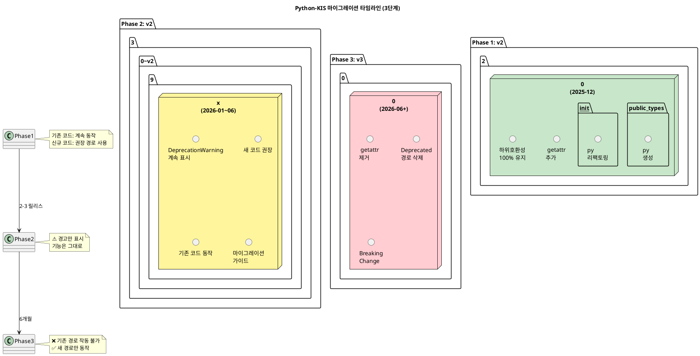
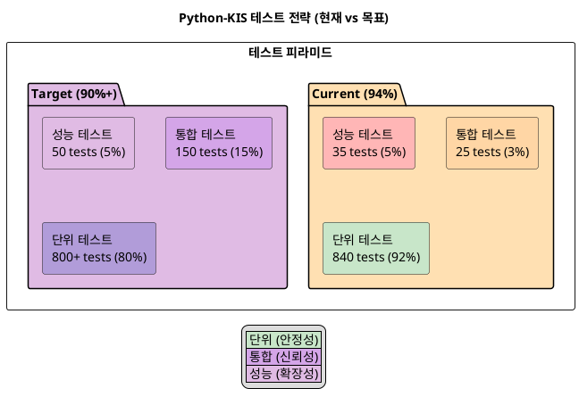

# 섹션 5: PlantUML 다이어그램 계획 (향후)

## 5.1 예정된 PlantUML 다이어그램

### 5.1.1 아키텍처 계층 다이어그램

**파일**: `docs/diagrams/architecture_layers.puml`

**목표**: Python-KIS의 7계층 아키텍처를 시각화

```puml
@startuml architecture_layers
!define ACCENT_COLOR #FF6B6B
!define GOOD_COLOR #51CF66
!define WARN_COLOR #FFA94D

title Python-KIS 계층화 아키텍처

rectangle "Application Layer\n(사용자 코드)" as APP #GOOD_COLOR
rectangle "Scope Layer\n(API 진입점)" as SCOPE #GOOD_COLOR
rectangle "Adapter Layer\n(Mixin, 기능 확장)" as ADAPTER #FFA94D
rectangle "API Layer\n(REST/WebSocket)" as API #GOOD_COLOR
rectangle "Client Layer\n(HTTP, WebSocket 통신)" as CLIENT #GOOD_COLOR
rectangle "Response Layer\n(응답 변환)" as RESPONSE #FFA94D
rectangle "Utility Layer\n(Rate Limit, Thread Safe)" as UTIL #GOOD_COLOR

APP --> SCOPE
SCOPE --> ADAPTER
ADAPTER --> API
API --> CLIENT
API --> RESPONSE
CLIENT --> UTIL

note right of APP
  kis = PyKis(...)
  quote = kis.stock("005930").quote()
end note

note right of SCOPE
  KisAccount
  KisStock
  KisStockScope
end note

note right of ADAPTER
  KisQuotableAccount
  KisOrderableAccount
  (Mixin 패턴)
end note

note right of API
  api.account.*
  api.stock.*
  api.websocket.*
end note

note right of CLIENT
  KisAuth (인증)
  HTTP 요청/응답
  WebSocket 연결
end note

note right of RESPONSE
  KisDynamic (동적 변환)
  Type Hint 생성
  자동 매핑
end note

note right of UTIL
  Rate Limiting
  Thread Safety
  Exception Handling
end note

@enduml
```

---

### 5.1.2 공개 타입 분리 다이어그램

**파일**: `docs/diagrams/type_separation.puml`

**목표**: 현재 vs 개선 후 타입 분리 구조

```puml
@startuml type_separation
title 공개 타입 모듈 분리 (현재 vs 개선)

' 현재 상태
package "현재 (v2.1.7)" #FFB6C1 {
  file "__init__.py" {
    circle "154개\n(혼란)" as NOW_INIT
  }
  file "types.py" {
    circle "154개\n(중복)" as NOW_TYPES
  }
  NOW_INIT -.->  NOW_TYPES: 동일 내용
}

' 개선 후
package "개선 (v2.2.0+)" #C8E6C9 {
  file "public_types.py" {
    circle "7개\n(공개 타입)\nQuote\nBalance\nOrder\nChart\nOrderbook\nMarketInfo\nTradingHours" as NEW_PUBLIC
  }
  file "__init__.py" {
    circle "15개\n(공개 API)\nPyKis\nKisAuth\n+ 7개 타입\n+ Helper 3개" as NEW_INIT
  }
  file "types.py" {
    circle "모든 Protocol\n(고급 사용자)" as NEW_TYPES
  }
  file "adapter/*.py" {
    circle "Mixin\n(내부 구현)" as NEW_ADAPTER
  }
  
  NEW_INIT -.->|재export| NEW_PUBLIC
  NEW_TYPES -.->|고급 사용자| NEW_ADAPTER
}

legend
  |<#C8E6C9> 개선 (↓ 154 → 15) |
  |<#FFB6C1> 현재 (중복, 혼란) |
end legend

@enduml
```

---

### 5.1.3 마이그레이션 타임라인 다이어그램

**파일**: `docs/diagrams/migration_timeline.puml`

**목표**: v2.2.0 → v3.0.0 마이그레이션 계획



---

### 5.1.4 테스트 전략 다이어그램

**파일**: `docs/diagrams/test_strategy.puml`

**목표**: 단위 vs 통합 vs 성능 테스트 전략



---

### 5.1.5 공개 API 크기 비교 다이어그램

**파일**: `docs/diagrams/api_size_comparison.puml`

**목표**: 154개 → 20개 축소 시각화

```puml
@startuml api_size_comparison
title 공개 API 크기 개선 (154개 → 20개)

left to right direction

' 현재
rectangle "현재\n154개 export" as NOW {
  rectangle "핵심\n2개\n(PyKis\nKisAuth)" as NOW_CORE
  rectangle "Protocol\n30개" as NOW_PROTO
  rectangle "Adapter\n40개" as NOW_ADAPTER  
  rectangle "기타\n82개" as NOW_OTHER
}

' 개선 후
rectangle "개선 후\n20개 export" as IMPROVED {
  rectangle "핵심\n2개\n(PyKis\nKisAuth)" as IMPR_CORE
  rectangle "공개 타입\n7개\n(Quote, Balance\nOrder, Chart\nOrderbook\nMarketInfo\nTradingHours)" as IMPR_TYPES
  rectangle "Helper\n3개\n(SimpleKIS\ncreate_client\nsave_config)" as IMPR_HELPER
  rectangle "예비\n8개" as IMPR_RESERVE
}

NOW_CORE -.->|변경없음| IMPR_CORE
NOW_PROTO -.->|types.py로| 제거
NOW_ADAPTER -.->|adapter/*.py로| 제거
NOW_OTHER -.->|내부화| 제거

@enduml
```

---

## 5.2 PlantUML 작업 할일 목록

| 순번 | 다이어그램 | 파일 | 상태 | 우선순위 | 예상 시간 |
|------|----------|------|------|---------|---------|
| 1 | 아키텍처 계층 | `architecture_layers.puml` | ⏳ 계획 | 🔴 높음 | 1시간 |
| 2 | 공개 타입 분리 | `type_separation.puml` | ⏳ 계획 | 🔴 높음 | 1시간 |
| 3 | 마이그레이션 타임라인 | `migration_timeline.puml` | ⏳ 계획 | 🟡 중간 | 1시간 |
| 4 | 테스트 전략 | `test_strategy.puml` | ⏳ 계획 | 🟡 중간 | 1시간 |
| 5 | API 크기 비교 | `api_size_comparison.puml` | ⏳ 계획 | 🟡 중간 | 1시간 |
| 6 | 데이터 흐름도 | `data_flow.puml` | ⏳ 계획 | 🟢 낮음 | 1.5시간 |
| 7 | 의존성 그래프 | `dependencies.puml` | ⏳ 계획 | 🟢 낮음 | 1.5시간 |
| 8 | 배포 파이프라인 | `deployment_pipeline.puml` | ⏳ 계획 | 🟢 낮음 | 1.5시간 |

**총 예상 시간**: 10시간

---

## 5.3 PlantUML 생성 및 배포 방법

### 5.3.1 로컬 생성 (개발자용)

```bash
# 1. PlantUML 설치
pip install plantuml

# 2. .puml 파일 생성
plantuml -Tpng docs/diagrams/architecture_layers.puml

# 3. PNG 생성됨
ls docs/diagrams/architecture_layers.png
```

### 5.3.2 온라인 렌더링 (문서용)

```markdown
# Markdown에 PlantUML 다이어그램 임베드


또는 GitHub에서 직접 .puml 파일 표시 지원
```

### 5.3.3 CI/CD 자동화 (향후)

```yaml
# .github/workflows/generate-diagrams.yml
name: Generate PlantUML Diagrams

on: [push]

jobs:
  generate:
    runs-on: ubuntu-latest
    steps:
      - uses: actions/checkout@v3
      - name: Generate PlantUML
        uses: grassedge/generate-plantuml-action@v11
        with:
          path: docs/diagrams
          format: png
      - name: Commit & Push
        run: |
          git add docs/diagrams/*.png
          git commit -m "📊 Update PlantUML diagrams"
          git push
```

---

## 5.4 PlantUML 추가 리소스

### 참고 문서
- PlantUML 공식: https://plantuml.com
- C4 Model 다이어그램: https://c4model.com
- 예제 모음: https://github.com/plantuml-stdlib

### 추천 도구
- **PlantUML Online Editor**: https://www.plantuml.com/plantuml/uml/
- **Visual Studio Code Extension**: `jebbs.plantuml`
- **GitHub Integration**: 자동 렌더링 지원

---

**다음: [결론 및 권장사항](#결론-및-권장사항)**
